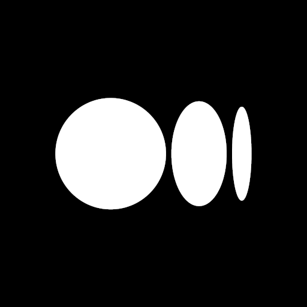

---
---

<!-- SPDX-License-Identifier: CC-BY-4.0 -->
<!-- Copyright Contributors to the Zowe project. -->

<section class="whitebackground">
    <h1 id="download" style="margin-bottom: 1.5rem">Interesting in joining or simply communicating with the Zowe community?</h1>
    
Page down to learn how we collaborate, where we share knowledge, and how best to engage with us!

    

        

            

                

                    <h5 class="text-left"><a href="{{ site.slack_url }}">Slack</a></h5>
                    
                

                
Hosted by the Open Mainframe Project, this is a messaging board where you can
                    directly engage with Zowe users and contributors - ask questions, engage in discussions, and
                    contribute your ideas!

                
Some popular channels to get started:
                <ul>
                    <li><a href="{{ site.zowe_onboarding_slack_url }}">#zowe-onboarding</a></li>
                    <li><a href="{{ site.zowe_user_slack_url }}">#zowe-help</a></li>
                    <li><a href="{{ site.zowe_cli_slack_url }}">#zowe-cli</a></li>
                    <li><a href="{{ site.zowe_explorer_slack_url }}">#zowe-explorer</a></li>
                    <li><a href="{{ site.apiml_slack_url }}">#zowe-api</a></li>
                    <li><a href="{{ site.zowe_doc_slack_url }}">#zowe-doc</a></li>
                </ul>
                

            

        

        

            

                

                    <h5 class="text-left"><a href="{{ site.omp_calendar_url }}">Meetings</a></h5>
                    
                

                
All scheduled meetings in the Zowe community are placed in the Open Mainframe
                    Project Calendar, from the scrum status of a squad to meetings of the Technical Steering Committee
                    and the Zowe Advisory Council. 

                
You are welcome to drop in on and contribute to any of these meetings! Check out the detailed
                    introduction to squad meetings and other recurring meetings! 

            

        

        

            

                

                    <h5 class="text-left"><a href="{{ site.github_repo_url }}">GitHub</a></h5>
                    
                

                
This is where all of Zowe’s code is, and where you can find detailed information
                    about each project and how to collaborate and contribute. This is the place to open issues, give
                    feedback, and contribute code.

                
Some good repos to get started:
                <ul>
                    <li><a href="{{ site.zowe_community_repo_url }}">community</a></li>
                    <li><a href="{{ site.zowe_docs_repo_url }}">docs-site</a></li>
                </ul>
                

            

        

    

    

        

            

                

                    <h5 class="text-left"><a href="https://medium.com/zowe">Articles</a></h5>
                    
                

                
Visit <a href="https://medium.com/zowe">medium.com/zowe</a>

            

        

        

            

                

                    <h5 class="text-left"><a href="https://www.youtube.com/playlist?list=PL8REpLGaY9QHtnElqPosteBFpITStkAxo">Videos</a></h5>
                    
                

                
Visit <a href="https://www.youtube.com/playlist?list=PL8REpLGaY9QHtnElqPosteBFpITStkAxo">Zowe Youtube Channel</a>

            

        

    

    

        <h2 style="margin-bottom: 1.5rem; margin-top: 2%">Join a squad call</h2>
        
Zowe is an open source project - this means that anyone can contribute to any part of it, and that includes
            you! The best ways to first get involved are <a href="{{ site.create_zowe_issue_url }}">opening issues on
                GitHub</a>, saying hi on Slack, or joining the weekly calls of one of the squads listed below.

        
Zowe’s most frequent and dedicated contributors work in teams called “squads”. If you have specific questions
            or are excited about a particular part of Zowe, connect with the relevant squad using the table below!
            Occasionally, some of the meetings might be changed, cancelled or rescheduled. Stay up to date on meetings
            in the <a href="{{ site.omp_calendar_url }}">Zowe meeting calendar</a> or the Slack channels.

        <iframe class="mt-4" src="https://zoom-lfx.platform.linuxfoundation.org/meetings/zowe" style="border: 0"
                width="100%" height="600" frameborder="0" scrolling="no"></iframe>
    

    

        <h2 style="margin-bottom: 1.5rem; margin-top: 2%">Find products & services that integrate with Zowe V3</h2>
        
Vendors & Consumers publish extensions and participate in our <a href="https://openmainframeproject.org/our-projects/zowe-conformance-program/">Open Mainframe Project's Zowe Vx
            Conformance Program.</a> to ensure they are interoperable with the specific Zowe Vx Version. All are free to download and use! Find participating, conformant extensions below (use the slide on the right of the page to advance the card view). Click the card to view conformance statistics. See a filtered list of products and solutions that have achieved V3 conformance in the <a href="https://landscape.openmainframeproject.org/card-mode?category=app-framework-zowe-v3,cli-zowe-v3,api-mediation-layer-zowe-v3,explorer-for-visual-studio-code-zowe-v3,explorer-for-visual-studio-code-zowe-v3,api-mediation-layer-zowe-v3,app-framework-zowe-v3,cli-zowe-v3&grouping=category" target="_blank">V3 Conformant Landscape</a> view presented below. (use the slide on the right of the page to advance the card view).

        <iframe frameBorder="0" id="landscape-v3" width="100%" height="600"
            src="https://landscape.openmainframeproject.org/card-mode?category=app-framework-zowe-v3,cli-zowe-v3,api-mediation-layer-zowe-v3,explorer-for-visual-studio-code-zowe-v3,explorer-for-visual-studio-code-zowe-v3,api-mediation-layer-zowe-v3,app-framework-zowe-v3,cli-zowe-v3&grouping=category"></iframe>
    

    

        <h2 style="margin-bottom: 1.5rem; margin-top: 2%">Find products & services that integrate with Zowe V2</h2>
        
Vendors & Consumers publish extensions and participate in our <a href="https://openmainframeproject.org/our-projects/zowe-conformance-program/">Open Mainframe Project's Zowe Vx
            Conformance Program.</a> to ensure they are interoperable with the specific Zowe Vx Version. All are free to download and use! Find participating, conformant extensions below (use the slide on the right of the page to advance the card view). Click the card to view conformance statistics. See a filtered list of products and solutions that have achieved V2 conformance in the <a href="https://landscape.openmainframeproject.org/card-mode?category=app-framework-zowe-v2,cli-zowe-v2,api-mediation-layer-zowe-v2,explorer-for-visual-studio-code-zowe-v2,explorer-for-visual-studio-code-zowe-v2,api-mediation-layer-zowe-v2,app-framework-zowe-v2,cli-zowe-v2&grouping=category" target="_blank">V2 Conformant Landscape</a> view presented below. (use the slide on the right of the page to advance the card view).

        <iframe frameBorder="0" id="landscape-v2" width="100%" height="600"
            src="https://landscape.openmainframeproject.org/card-mode?category=app-framework-zowe-v2,cli-zowe-v2,api-mediation-layer-zowe-v2,explorer-for-visual-studio-code-zowe-v2,explorer-for-visual-studio-code-zowe-v2,api-mediation-layer-zowe-v2,app-framework-zowe-v2,cli-zowe-v2&grouping=category"></iframe>
    

    

        <h2 style="margin-bottom: 1.5rem; margin-top: 2%">Find Zowe support providers</h2>
        
Vendors have the ability to participate in our <a href="https://openmainframeproject.org/our-projects/zowe-conformant-support-provider-program/">Open Mainframe Project Zowe Vx Support Provider Conformance program</a>. Vendor Offerings that earn this badge have satisfied the requirements necessary to ensure they are capable of providing Support for the specific Zowe core component(s). Note: the "Comprehensive Support designation indicates the offering is capable of providing support for ALL of the Zowe components designated as "core" for the specific Zowe version. Take a look at the landscape below to find an offering.

        <iframe frameBorder="0" id="landscape-support-providers" width="100%" height="600"
            src="https://landscape.openmainframeproject.org/pages/zowe-conformant-support-vendor"></iframe>
    

</section>
