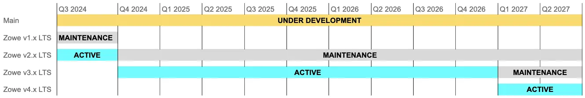

---
---

<!-- SPDX-License-Identifier: CC-BY-4.0 -->
<!-- Copyright Contributors to the Zowe project. -->

<section class="whitebackground">
  <h1 id="download">Download Zowe</h1>
  

    

      

        Zowe has both server and client components, which you can install independently. Download the latest installer
        to install Zowe on the z/OS server, on your computer, or both. Start your journey with Zowe today!
      

      

        

          <a href="#download-v3" class="card-link" style="margin-left: 1.25rem">
            <svg width="1em" height="1em" viewBox="0 0 16 16" class="bi bi-arrow-right-circle" fill="currentColor"
              xmlns="http://www.w3.org/2000/svg">
              <path fill-rule="evenodd" d="M8 15A7 7 0 1 0 8 1a7 7 0 0 0 0 14zm0 1A8 8 0 1 0 8 0a8 8 0 0 0 0 16z" />
              <path fill-rule="evenodd"
                d="M7.646 11.354a.5.5 0 0 1 0-.708L10.293 8 7.646 5.354a.5.5 0 1 1 .708-.708l3 3a.5.5 0 0 1 0 .708l-3 3a.5.5 0 0 1-.708 0z" />
              <path fill-rule="evenodd" d="M4.5 8a.5.5 0 0 1 .5-.5h5a.5.5 0 0 1 0 1H5a.5.5 0 0 1-.5-.5z" /></svg>
            Latest V3 Release
          </a>
          <a href="#download-v2" class="card-link" style="margin-left: 1.25rem">
            <svg width="1em" height="1em" viewBox="0 0 16 16" class="bi bi-arrow-right-circle" fill="currentColor"
              xmlns="http://www.w3.org/2000/svg">
              <path fill-rule="evenodd" d="M8 15A7 7 0 1 0 8 1a7 7 0 0 0 0 14zm0 1A8 8 0 1 0 8 0a8 8 0 0 0 0 16z" />
              <path fill-rule="evenodd"
                d="M7.646 11.354a.5.5 0 0 1 0-.708L10.293 8 7.646 5.354a.5.5 0 1 1 .708-.708l3 3a.5.5 0 0 1 0 .708l-3 3a.5.5 0 0 1-.708 0z" />
              <path fill-rule="evenodd" d="M4.5 8a.5.5 0 0 1 .5-.5h5a.5.5 0 0 1 0 1H5a.5.5 0 0 1-.5-.5z" /></svg>
            Latest V2 Release
          </a>
          <a href="#zowe-technical-preview" class="card-link">
            <svg width="1em" height="1em" viewBox="0 0 16 16" class="bi bi-arrow-right-circle" fill="currentColor"
              xmlns="http://www.w3.org/2000/svg">
              <path fill-rule="evenodd" d="M8 15A7 7 0 1 0 8 1a7 7 0 0 0 0 14zm0 1A8 8 0 1 0 8 0a8 8 0 0 0 0 16z" />
              <path fill-rule="evenodd"
                d="M7.646 11.354a.5.5 0 0 1 0-.708L10.293 8 7.646 5.354a.5.5 0 1 1 .708-.708l3 3a.5.5 0 0 1 0 .708l-3 3a.5.5 0 0 1-.708 0z" />
              <path fill-rule="evenodd" d="M4.5 8a.5.5 0 0 1 .5-.5h5a.5.5 0 0 1 0 1H5a.5.5 0 0 1-.5-.5z" /></svg>
            Technical Preview
          </a>
          <a href="#all-v3-releases" class="card-link">
            <svg width="1em" height="1em" viewBox="0 0 16 16" class="bi bi-arrow-right-circle" fill="currentColor"
              xmlns="http://www.w3.org/2000/svg">
              <path fill-rule="evenodd" d="M8 15A7 7 0 1 0 8 1a7 7 0 0 0 0 14zm0 1A8 8 0 1 0 8 0a8 8 0 0 0 0 16z" />
              <path fill-rule="evenodd"
                d="M7.646 11.354a.5.5 0 0 1 0-.708L10.293 8 7.646 5.354a.5.5 0 1 1 .708-.708l3 3a.5.5 0 0 1 0 .708l-3 3a.5.5 0 0 1-.708 0z" />
              <path fill-rule="evenodd" d="M4.5 8a.5.5 0 0 1 .5-.5h5a.5.5 0 0 1 0 1H5a.5.5 0 0 1-.5-.5z" /></svg>
            All Zowe V3.x Releases
          </a>
          <a href="#all-v2-releases" class="card-link">
            <svg width="1em" height="1em" viewBox="0 0 16 16" class="bi bi-arrow-right-circle" fill="currentColor"
              xmlns="http://www.w3.org/2000/svg">
              <path fill-rule="evenodd" d="M8 15A7 7 0 1 0 8 1a7 7 0 0 0 0 14zm0 1A8 8 0 1 0 8 0a8 8 0 0 0 0 16z" />
              <path fill-rule="evenodd"
                d="M7.646 11.354a.5.5 0 0 1 0-.708L10.293 8 7.646 5.354a.5.5 0 1 1 .708-.708l3 3a.5.5 0 0 1 0 .708l-3 3a.5.5 0 0 1-.708 0z" />
              <path fill-rule="evenodd" d="M4.5 8a.5.5 0 0 1 .5-.5h5a.5.5 0 0 1 0 1H5a.5.5 0 0 1-.5-.5z" /></svg>
            All Zowe V2.x Releases
          </a>
          <a href="#all-v1-releases" class="card-link">
            <svg width="1em" height="1em" viewBox="0 0 16 16" class="bi bi-arrow-right-circle" fill="currentColor"
              xmlns="http://www.w3.org/2000/svg">
              <path fill-rule="evenodd" d="M8 15A7 7 0 1 0 8 1a7 7 0 0 0 0 14zm0 1A8 8 0 1 0 8 0a8 8 0 0 0 0 16z" />
              <path fill-rule="evenodd"
                d="M7.646 11.354a.5.5 0 0 1 0-.708L10.293 8 7.646 5.354a.5.5 0 1 1 .708-.708l3 3a.5.5 0 0 1 0 .708l-3 3a.5.5 0 0 1-.708 0z" />
              <path fill-rule="evenodd" d="M4.5 8a.5.5 0 0 1 .5-.5h5a.5.5 0 0 1 0 1H5a.5.5 0 0 1-.5-.5z" /></svg>
            All Zowe V1.x Releases
          </a>
          <a href="#timeline" class="card-link">
            <svg width="1em" height="1em" viewBox="0 0 16 16" class="bi bi-arrow-right-circle" fill="currentColor"
              xmlns="http://www.w3.org/2000/svg">
              <path fill-rule="evenodd" d="M8 15A7 7 0 1 0 8 1a7 7 0 0 0 0 14zm0 1A8 8 0 1 0 8 0a8 8 0 0 0 0 16z" />
              <path fill-rule="evenodd"
                d="M7.646 11.354a.5.5 0 0 1 0-.708L10.293 8 7.646 5.354a.5.5 0 1 1 .708-.708l3 3a.5.5 0 0 1 0 .708l-3 3a.5.5 0 0 1-.708 0z" />
              <path fill-rule="evenodd" d="M4.5 8a.5.5 0 0 1 .5-.5h5a.5.5 0 0 1 0 1H5a.5.5 0 0 1-.5-.5z" /></svg>
            Releases Timeline
          </a>
          <a href="#compatibility-extensions" class="card-link">
            <svg width="1em" height="1em" viewBox="0 0 16 16" class="bi bi-arrow-right-circle" fill="currentColor"
              xmlns="http://www.w3.org/2000/svg">
              <path fill-rule="evenodd" d="M8 15A7 7 0 1 0 8 1a7 7 0 0 0 0 14zm0 1A8 8 0 1 0 8 0a8 8 0 0 0 0 16z" />
              <path fill-rule="evenodd"
                d="M7.646 11.354a.5.5 0 0 1 0-.708L10.293 8 7.646 5.354a.5.5 0 1 1 .708-.708l3 3a.5.5 0 0 1 0 .708l-3 3a.5.5 0 0 1-.708 0z" />
              <path fill-rule="evenodd" d="M4.5 8a.5.5 0 0 1 .5-.5h5a.5.5 0 0 1 0 1H5a.5.5 0 0 1-.5-.5z" /></svg>
            Zowe Extensions V2 Compatibility, Conformance, and Availability Statement
          </a>
          <a href="#builds" class="card-link">
            <svg width="1em" height="1em" viewBox="0 0 16 16" class="bi bi-arrow-right-circle" fill="currentColor"
              xmlns="http://www.w3.org/2000/svg">
              <path fill-rule="evenodd" d="M8 15A7 7 0 1 0 8 1a7 7 0 0 0 0 14zm0 1A8 8 0 1 0 8 0a8 8 0 0 0 0 16z" />
              <path fill-rule="evenodd"
                d="M7.646 11.354a.5.5 0 0 1 0-.708L10.293 8 7.646 5.354a.5.5 0 1 1 .708-.708l3 3a.5.5 0 0 1 0 .708l-3 3a.5.5 0 0 1-.708 0z" />
              <path fill-rule="evenodd" d="M4.5 8a.5.5 0 0 1 .5-.5h5a.5.5 0 0 1 0 1H5a.5.5 0 0 1-.5-.5z" /></svg>
            Nightly Builds
          </a>
        

      

    

  

  
 

  <!--V3 download as follows -->
  <h2 id="download-v3">Zowe V3</h2>
  
  

    

      <h4 class="card-header" id="zen">Zowe Server Install Wizard</h4>
         

          
The Zowe Server Install Wizard (formerly known as ZEN) is a program for your Windows/Mac/Linux PC to install the Zowe Server-side components via a guided wizard. Wizard offers options for online download, PAX archive upload, and SMP/E, with both V2 and V3 support.
           
         An alternative to the existing Zowe installation process, the Wizard is designed to make installation quick and intuitive 
         by guiding you through installing Zowe server content onto <b>z/OS</b>.
         It handles <b>YAML</b>, <b>Unix</b>, and <b>JCL</b> content involved in setup of a Zowe instance 
         so that you can install Zowe easily by following prompts and verifying the output.

          <h5 class="card-title">Direct download</h5>
          
<a class="btn btn-primary"
                href="{{ site.zen_windows_download_url }}{{ site.data.releases.v2[0].zen_version }}">Zowe V3/V2 Server Install Wizard
                {{ site.data.releases.v2[0].zen_version }} Windows 🖥️ Installer</a>

          
<a class="btn btn-primary"
                href="{{ site.zen_unix_rpm_download_url }}{{ site.data.releases.v2[0].zen_version }}">Zowe V3/V2 Server Install Wizard
                {{ site.data.releases.v2[0].zen_version }} linux.rpm 🐧 Installer</a>

          
<a class="btn btn-primary"
                href="{{ site.zen_unix_deb_download_url }}{{ site.data.releases.v2[0].zen_version }}">Zowe V3/V2 Server Install Wizard
                {{ site.data.releases.v2[0].zen_version }} linux.deb 🐧 Installer</a>

          
<a class="btn btn-primary"
                href="{{ site.zen_mac_download_url }}{{ site.data.releases.v2[0].zen_version }}">Zowe V3/V2 Server Install Wizard
                {{ site.data.releases.v2[0].zen_version }} Mac 🍏 Installer</a>

         

      <h4 class="card-header" id="zowe-zos-build-download">Server-side components installer</h4>
      

        
Manually install Zowe z/OS components from the <b>convenience build</b>, the <b>SMP/E build</b>,
          the <b> PSWI build </b> or the <b> containerization build </b> depending on your need.

        

          

            <h5 class="card-title">Convenience build</h5>
            
PAX archive format installed on the z/OS server

            
<a class="btn btn-primary"
                href="{{ site.zos_download_url }}{{ site.data.releases.v3[0].zos_version }}">Zowe
                {{ site.data.releases.v3[0].zos_version }} z/OS Convenience build</a>

            

              <a href="https://docs.zowe.org/{{ site.data.releases.v3[0].documentation }}/user-guide/install-zos"
                class="card-link">
                <svg width="1em" height="1em" viewBox="0 0 16 16" class="bi bi-arrow-right-circle" fill="currentColor"
                  xmlns="http://www.w3.org/2000/svg">
                  <path fill-rule="evenodd" d="M8 15A7 7 0 1 0 8 1a7 7 0 0 0 0 14zm0 1A8 8 0 1 0 8 0a8 8 0 0 0 0 16z" />
                  <path fill-rule="evenodd"
                    d="M7.646 11.354a.5.5 0 0 1 0-.708L10.293 8 7.646 5.354a.5.5 0 1 1 .708-.708l3 3a.5.5 0 0 1 0 .708l-3 3a.5.5 0 0 1-.708 0z" />
                  <path fill-rule="evenodd" d="M4.5 8a.5.5 0 0 1 .5-.5h5a.5.5 0 0 1 0 1H5a.5.5 0 0 1-.5-.5z" /></svg>
                Read installation docs
              </a>
            

          

          

            <h5 class="card-title">SMP/E build</h5>
            
SMP/E format installed on the z/OS server

            
            
Download the base FMID AZWE003 (based on v3.0.0) 
              
            first and then apply the PTFs 
            
            to get the latest version. 

            
<a class="btn btn-primary" href="{{ site.smpe_download_url }}{{ site.zowe_v3_fmid_oss_version }}">Zowe 3.0.0
                FMID {{ site.zowe_v3_fmid }}</a>

            
            
<a class="btn btn-primary"
                  href="{{ site.smpe_download_url }}{{ site.data.releases.v3[0].smpe_version }}">Zowe
                  {{ site.data.releases.v3[0].zos_version }} {{ site.data.releases.v3[0].smpe_sysmod }}
                  {{ site.data.releases.v3[0].smpe_numbers }}</a>

            
            

              <a href="https://docs.zowe.org/{{ site.data.releases.v3[0].documentation }}/user-guide/install-zos"
                class="card-link">
                <svg width="1em" height="1em" viewBox="0 0 16 16" class="bi bi-arrow-right-circle" fill="currentColor"
                  xmlns="http://www.w3.org/2000/svg">
                  <path fill-rule="evenodd" d="M8 15A7 7 0 1 0 8 1a7 7 0 0 0 0 14zm0 1A8 8 0 1 0 8 0a8 8 0 0 0 0 16z" />
                  <path fill-rule="evenodd"
                    d="M7.646 11.354a.5.5 0 0 1 0-.708L10.293 8 7.646 5.354a.5.5 0 1 1 .708-.708l3 3a.5.5 0 0 1 0 .708l-3 3a.5.5 0 0 1-.708 0z" />
                  <path fill-rule="evenodd" d="M4.5 8a.5.5 0 0 1 .5-.5h5a.5.5 0 0 1 0 1H5a.5.5 0 0 1-.5-.5z" /></svg>
                Read installation docs
              </a>
            

          

          

            <h5 class="card-title" id="zowe-pswi">Zowe Portable Software Instance</h5>
            
The Zowe Portable Software Instance (PSWI) is a new way of z/OS component
              distribution. The PSWI allows the full installation as you are used to from SMP/E build, but it uses the
              new standard for mainframe software distribution.

            
Download the PSWI based on FMID AZWE003

            
<a class="btn btn-primary"
                href="{{ site.pswi_download_uri }}{{ site.data.releases.v3[0].zos_version }}">Zowe PSWI
                {{ site.data.releases.v3[0].zos_version }}</a>

            

              <a href="https://docs.zowe.org/{{ site.data.releases.v3[0].documentation }}/user-guide/install-zowe-pswi" class="card-link">
                <svg width="1em" height="1em" viewBox="0 0 16 16" class="bi bi-arrow-right-circle" fill="currentColor"
                  xmlns="http://www.w3.org/2000/svg">
                  <path fill-rule="evenodd" d="M8 15A7 7 0 1 0 8 1a7 7 0 0 0 0 14zm0 1A8 8 0 1 0 8 0a8 8 0 0 0 0 16z" />
                  <path fill-rule="evenodd"
                    d="M7.646 11.354a.5.5 0 0 1 0-.708L10.293 8 7.646 5.354a.5.5 0 1 1 .708-.708l3 3a.5.5 0 0 1 0 .708l-3 3a.5.5 0 0 1-.708 0z" />
                  <path fill-rule="evenodd" d="M4.5 8a.5.5 0 0 1 .5-.5h5a.5.5 0 0 1 0 1H5a.5.5 0 0 1-.5-.5z" /></svg>
                Read installation docs
              </a>
            

          

          

              <h5 class="card-title">Containerization build</h5>
              
Files to launch Zowe in a container environment like Kubernetes

              

                <a href="" class="btn btn-secondary disabled">Coming Soon</a>
                <!--
                
                <a class="btn btn-primary"
                  href="{{ site.containerization_download_url }}{{ site.data.releases.v3[0].containerization_version }}">Zowe
                  {{ site.data.releases.v3[0].containerization_version }} Containerization build</a>
                
                <a class="btn btn-primary"
                href="{{ site.containerization_download_url }}{{ site.data.releases.v3[0].zos_version }}">Zowe
                {{ site.data.releases.v3[0].zos_version }} Containerization build</a>
                
                -->
              

              

                <a href="https://docs.zowe.org/{{ site.data.releases.v3[0].documentation }}/user-guide/k8s-introduction/"
                  class="card-link">
                  <svg width="1em" height="1em" viewBox="0 0 16 16" class="bi bi-arrow-right-circle" fill="currentColor"
                    xmlns="http://www.w3.org/2000/svg">
                    <path fill-rule="evenodd"
                      d="M8 15A7 7 0 1 0 8 1a7 7 0 0 0 0 14zm0 1A8 8 0 1 0 8 0a8 8 0 0 0 0 16z" />
                    <path fill-rule="evenodd"
                      d="M7.646 11.354a.5.5 0 0 1 0-.708L10.293 8 7.646 5.354a.5.5 0 1 1 .708-.708l3 3a.5.5 0 0 1 0 .708l-3 3a.5.5 0 0 1-.708 0z" />
                    <path fill-rule="evenodd" d="M4.5 8a.5.5 0 0 1 .5-.5h5a.5.5 0 0 1 0 1H5a.5.5 0 0 1-.5-.5z" /></svg>
                  Read installation docs
                </a>
              

            

        

      

    

    

      <h4 class="card-header">Client-side component installer</h4>
      

        
Install <b>Zowe CLI</b>, <b>Zowe Client SDKs</b>, <b>Zowe Explorer for VSCode</b>, or <b>Zowe Explorer for IntelliJ IDEA</b>, a rich set of client tools for easier interaction with the mainframe.

        

          

            <h5 class="card-title" id="zowe-cli-download">Zowe CLI</h5>
            
Install Zowe CLI from the local package or from an npm registry if your computer is
              connected to the Internet.

            
Download the Zowe CLI core package and optionally download the plug-ins (CICS, Db2,
              IMS, MQ, z/OS FTP, and so on) to gain more capabilities.

            
<a class="btn btn-primary"
                href="{{ site.cli_download_url }}{{ site.data.releases.v3[0].cli_version }}">Zowe
                {{ site.data.releases.v3[0].cli_plugins_version }} CLI Core</a>

            
<a class="btn btn-primary"
                href="{{ site.cli_plugins_download_url }}{{ site.data.releases.v3[0].cli_plugins_version }}">Zowe
                {{ site.data.releases.v3[0].cli_plugins_version }} CLI Plug-ins</a>

            

              <a href="{{ site.zowe_cli_install_doc_url }}" class="card-link">
                <svg width="1em" height="1em" viewBox="0 0 16 16" class="bi bi-arrow-right-circle" fill="currentColor"
                  xmlns="http://www.w3.org/2000/svg">
                  <path fill-rule="evenodd" d="M8 15A7 7 0 1 0 8 1a7 7 0 0 0 0 14zm0 1A8 8 0 1 0 8 0a8 8 0 0 0 0 16z" />
                  <path fill-rule="evenodd"
                    d="M7.646 11.354a.5.5 0 0 1 0-.708L10.293 8 7.646 5.354a.5.5 0 1 1 .708-.708l3 3a.5.5 0 0 1 0 .708l-3 3a.5.5 0 0 1-.708 0z" />
                  <path fill-rule="evenodd" d="M4.5 8a.5.5 0 0 1 .5-.5h5a.5.5 0 0 1 0 1H5a.5.5 0 0 1-.5-.5z" /></svg>
                Read installation docs
              </a>
            

          

          

            <h5 class="card-title">Zowe Client SDKs</h5>
            
Download the Zowe Software Development Kits (SDKs) for use in development and
              automation.

            
<a class="btn btn-primary"
                href="{{ site.zowe_node_sdk_download_url }}{{ site.data.releases.v3[0].node_sdk_version }}">Zowe
                {{ site.data.releases.v3[0].node_sdk_version }} Node.js Client SDK</a>

            

              <a href="{{ site.zowe_sdk_install_doc_url }}"
                class="card-link">
                <svg width="1em" height="1em" viewBox="0 0 16 16" class="bi bi-arrow-right-circle" fill="currentColor"
                  xmlns="http://www.w3.org/2000/svg">
                  <path fill-rule="evenodd" d="M8 15A7 7 0 1 0 8 1a7 7 0 0 0 0 14zm0 1A8 8 0 1 0 8 0a8 8 0 0 0 0 16z" />
                  <path fill-rule="evenodd"
                    d="M7.646 11.354a.5.5 0 0 1 0-.708L10.293 8 7.646 5.354a.5.5 0 1 1 .708-.708l3 3a.5.5 0 0 1 0 .708l-3 3a.5.5 0 0 1-.708 0z" />
                  <path fill-rule="evenodd" d="M4.5 8a.5.5 0 0 1 .5-.5h5a.5.5 0 0 1 0 1H5a.5.5 0 0 1-.5-.5z" /></svg>
                Browse SDK docs
              </a>
            

          

          

            <h5 class="card-title">Zowe Explorer for VSCode</h5>
            
Zowe Explorer for VSCode V3 no longer supports V1 profiles. If you are using V1 profiles with V2, you must migrate them to the new format.

            
Zowe Explorer downloads are available on the VSCode Marketplace. To view installation instructions for the VSCode Marketplace, follow the installation docs link below.

            <h5 class="card-title" style="font-size: 18px">Direct download</h5>
            
To download the V3 version of the FTP and CICS extensions, click <b>Zowe Explorer {{ site.data.releases.v3[0].explorer_version }}</b>. Separate downloads are available for Zowe Explorer and Zowe Explorer
              Extension for FTP.

            
To install the <em>.vsix</em> files, use <b>Extensions > Install from vsix</b> within
              VS Code.

              

                
<a class="btn btn-primary" href="{{ site.zowe_explorer_next_github_url }}">Zowe Explorer for VSCode
                    {{ site.data.releases.v3[0].explorer_version }}
                  </a>

                

                  <a href="{{ site.zowe_explorer_install_doc_url }}" class="card-link">
                    <svg width="1em" height="1em" viewBox="0 0 16 16" class="bi bi-arrow-right-circle"
                      fill="currentColor" xmlns="http://www.w3.org/2000/svg">
                      <path fill-rule="evenodd"
                        d="M8 15A7 7 0 1 0 8 1a7 7 0 0 0 0 14zm0 1A8 8 0 1 0 8 0a8 8 0 0 0 0 16z" />
                      <path fill-rule="evenodd"
                        d="M7.646 11.354a.5.5 0 0 1 0-.708L10.293 8 7.646 5.354a.5.5 0 1 1 .708-.708l3 3a.5.5 0 0 1 0 .708l-3 3a.5.5 0 0 1-.708 0z" />
                      <path fill-rule="evenodd" d="M4.5 8a.5.5 0 0 1 .5-.5h5a.5.5 0 0 1 0 1H5a.5.5 0 0 1-.5-.5z" />
                    </svg>
                    Read installation docs
                  </a>
                

              

          

          

            <h5 class="card-title">Zowe Explorer for IntelliJ IDEA</h5>
            
Zowe Explorer for IntelliJ IDEA brings support for browsing, editing and creating data on z/OS in IntelliJ IDEA.

            <h5 class="card-title" style="font-size: 18px">Marketplace Installation</h5>
            
Zowe Explorer for IntelliJ is available through the IntelliJ Marketplace.

              

                
<a class="btn btn-primary" href="{{ site.zowe_intellij_explorer_marketplace_url }}">Zowe Explorer for IntelliJ
                    {{ site.data.releases.v3[0].intellij_explorer_version }}
                  </a>

                

                  <a href="{{ site.zowe_intellij_explorer_install_doc_url }}" class="card-link">
                    <svg width="1em" height="1em" viewBox="0 0 16 16" class="bi bi-arrow-right-circle"
                      fill="currentColor" xmlns="http://www.w3.org/2000/svg">
                      <path fill-rule="evenodd"
                        d="M8 15A7 7 0 1 0 8 1a7 7 0 0 0 0 14zm0 1A8 8 0 1 0 8 0a8 8 0 0 0 0 16z" />
                      <path fill-rule="evenodd"
                        d="M7.646 11.354a.5.5 0 0 1 0-.708L10.293 8 7.646 5.354a.5.5 0 1 1 .708-.708l3 3a.5.5 0 0 1 0 .708l-3 3a.5.5 0 0 1-.708 0z" />
                      <path fill-rule="evenodd" d="M4.5 8a.5.5 0 0 1 .5-.5h5a.5.5 0 0 1 0 1H5a.5.5 0 0 1-.5-.5z" />
                    </svg>
                    Read installation docs
                  </a>
                

              

          

        

      

    

  

  

  <!--V2 download as follows -->
  <h2 id="download-v2">Zowe V2</h2>
  
  

    

      <h4 class="card-header" id="zowe-zos-build-download">Server-side components installer</h4>
      

        
Manually install Zowe z/OS components from the <b>convenience build</b>, the <b>SMP/E build</b>,
          the <b> PSWI build </b> or the <b> containerization build </b> depending on your need.

        

          

            <h5 class="card-title">Convenience build</h5>
            
PAX archive format installed on the z/OS server

            
<a class="btn btn-primary"
                href="{{ site.zos_download_url }}{{ site.data.releases.v2[0].zos_version }}">Zowe
                {{ site.data.releases.v2[0].zos_version }} z/OS Convenience build</a>

            

              <a href="https://docs.zowe.org/{{ site.data.releases.v2[0].documentation }}/user-guide/install-zos"
                class="card-link">
                <svg width="1em" height="1em" viewBox="0 0 16 16" class="bi bi-arrow-right-circle" fill="currentColor"
                  xmlns="http://www.w3.org/2000/svg">
                  <path fill-rule="evenodd" d="M8 15A7 7 0 1 0 8 1a7 7 0 0 0 0 14zm0 1A8 8 0 1 0 8 0a8 8 0 0 0 0 16z" />
                  <path fill-rule="evenodd"
                    d="M7.646 11.354a.5.5 0 0 1 0-.708L10.293 8 7.646 5.354a.5.5 0 1 1 .708-.708l3 3a.5.5 0 0 1 0 .708l-3 3a.5.5 0 0 1-.708 0z" />
                  <path fill-rule="evenodd" d="M4.5 8a.5.5 0 0 1 .5-.5h5a.5.5 0 0 1 0 1H5a.5.5 0 0 1-.5-.5z" /></svg>
                Read installation docs
              </a>
            

          

          

            <h5 class="card-title">SMP/E build</h5>
            
SMP/E format installed on the z/OS server

            
Download the base FMID AZWE002 (based on v2.0.0) first and then apply the PTFs to get
                the latest version. 

            
<a class="btn btn-primary" href="{{ site.smpe_download_url }}{{ site.zowe_v2_fmid_oss_version }}">Zowe 2.0.0
                FMID {{ site.zowe_v2_fmid }}</a>

            
<a class="btn btn-primary"
                  href="{{ site.smpe_download_url }}{{ site.data.releases.v2[0].smpe_version }}">Zowe
                  {{ site.data.releases.v2[0].zos_version }} {{ site.data.releases.v2[0].smpe_sysmod }}
                  {{ site.data.releases.v2[0].smpe_numbers }}</a>

            

              <a href="https://docs.zowe.org/{{ site.data.releases.v2[0].documentation }}/user-guide/install-zos"
                class="card-link">
                <svg width="1em" height="1em" viewBox="0 0 16 16" class="bi bi-arrow-right-circle" fill="currentColor"
                  xmlns="http://www.w3.org/2000/svg">
                  <path fill-rule="evenodd" d="M8 15A7 7 0 1 0 8 1a7 7 0 0 0 0 14zm0 1A8 8 0 1 0 8 0a8 8 0 0 0 0 16z" />
                  <path fill-rule="evenodd"
                    d="M7.646 11.354a.5.5 0 0 1 0-.708L10.293 8 7.646 5.354a.5.5 0 1 1 .708-.708l3 3a.5.5 0 0 1 0 .708l-3 3a.5.5 0 0 1-.708 0z" />
                  <path fill-rule="evenodd" d="M4.5 8a.5.5 0 0 1 .5-.5h5a.5.5 0 0 1 0 1H5a.5.5 0 0 1-.5-.5z" /></svg>
                Read installation docs
              </a>
            

          

          

            <h5 class="card-title" id="zowe-pswi">Zowe Portable Software Instance</h5>
            
The Zowe Portable Software Instance (PSWI) is a new way of z/OS component
              distribution. The PSWI allows the full installation as you are used to from SMP/E build, but it uses the
              new standard for mainframe software distribution.

            
Download the PSWI based on FMID AZWE002

            
            
Caution: This PSWI release <b>does not match</b> the latest Zowe release, seen above. Please check the home page announcements for more information.

            
            
            
<a class="btn btn-primary"
                href="{{ site.pswi_download_uri }}{{ site.data.releases.v2[0].pswi_version }}">Zowe PSWI
                {{ site.data.releases.v2[0].pswi_version }}</a>

            
            
<a class="btn btn-primary"
              href="{{ site.pswi_download_uri }}{{ site.data.releases.v2[0].zos_version }}">Zowe PSWI
              {{ site.data.releases.v2[0].zos_version }}</a>

            
            

              <a href="https://docs.zowe.org/{{ site.data.releases.v2[0].documentation }}/user-guide/install-zowe-pswi" class="card-link">
                <svg width="1em" height="1em" viewBox="0 0 16 16" class="bi bi-arrow-right-circle" fill="currentColor"
                  xmlns="http://www.w3.org/2000/svg">
                  <path fill-rule="evenodd" d="M8 15A7 7 0 1 0 8 1a7 7 0 0 0 0 14zm0 1A8 8 0 1 0 8 0a8 8 0 0 0 0 16z" />
                  <path fill-rule="evenodd"
                    d="M7.646 11.354a.5.5 0 0 1 0-.708L10.293 8 7.646 5.354a.5.5 0 1 1 .708-.708l3 3a.5.5 0 0 1 0 .708l-3 3a.5.5 0 0 1-.708 0z" />
                  <path fill-rule="evenodd" d="M4.5 8a.5.5 0 0 1 .5-.5h5a.5.5 0 0 1 0 1H5a.5.5 0 0 1-.5-.5z" /></svg>
                Read installation docs
              </a>
            

          

          

              <h5 class="card-title">Containerization build</h5>
              
Files to launch Zowe in a container environment like Kubernetes

              

                
                <a class="btn btn-primary"
                  href="{{ site.containerization_download_url }}{{ site.data.releases.v2[0].containerization_version }}">Zowe
                  {{ site.data.releases.v2[0].containerization_version }} Containerization build</a>
                
                <a class="btn btn-primary"
                href="{{ site.containerization_download_url }}{{ site.data.releases.v2[0].zos_version }}">Zowe
                {{ site.data.releases.v2[0].zos_version }} Containerization build</a>
                
              

              

                <a href="https://docs.zowe.org/{{ site.data.releases.v2[0].documentation }}/user-guide/k8s-introduction/"
                  class="card-link">
                  <svg width="1em" height="1em" viewBox="0 0 16 16" class="bi bi-arrow-right-circle" fill="currentColor"
                    xmlns="http://www.w3.org/2000/svg">
                    <path fill-rule="evenodd"
                      d="M8 15A7 7 0 1 0 8 1a7 7 0 0 0 0 14zm0 1A8 8 0 1 0 8 0a8 8 0 0 0 0 16z" />
                    <path fill-rule="evenodd"
                      d="M7.646 11.354a.5.5 0 0 1 0-.708L10.293 8 7.646 5.354a.5.5 0 1 1 .708-.708l3 3a.5.5 0 0 1 0 .708l-3 3a.5.5 0 0 1-.708 0z" />
                    <path fill-rule="evenodd" d="M4.5 8a.5.5 0 0 1 .5-.5h5a.5.5 0 0 1 0 1H5a.5.5 0 0 1-.5-.5z" /></svg>
                  Read installation docs
                </a>
              

            

        

      

    

    

      <h4 class="card-header">Client-side component installer</h4>
      

        
Install <b>Zowe CLI</b> or <b>Zowe Explorer</b>, a Visual Studio Code extension powered by
          Zowe CLI.

        

          

            <h5 class="card-title" id="zowe-cli-download">Zowe CLI</h5>
            
Install Zowe CLI from the local package or from an npm registry if your computer is
              connected to the Internet.

            
Download the Zowe CLI core package and optionally download the plug-ins (CICS, Db2,
              IMS, MQ, z/OS FTP, and so on) to gain more capabilities.

            
<a class="btn btn-primary"
                href="{{ site.cli_download_url }}{{ site.data.releases.v2[0].cli_version }}">Zowe
                {{ site.data.releases.v2[0].cli_plugins_version }} CLI Core</a>

            
<a class="btn btn-primary"
                href="{{ site.cli_plugins_download_url }}{{ site.data.releases.v2[0].cli_plugins_version }}">Zowe
                {{ site.data.releases.v2[0].cli_plugins_version }} CLI Plug-ins</a>

            

              <a href="{{ site.zowe_cli_install_doc_url }}" class="card-link">
                <svg width="1em" height="1em" viewBox="0 0 16 16" class="bi bi-arrow-right-circle" fill="currentColor"
                  xmlns="http://www.w3.org/2000/svg">
                  <path fill-rule="evenodd" d="M8 15A7 7 0 1 0 8 1a7 7 0 0 0 0 14zm0 1A8 8 0 1 0 8 0a8 8 0 0 0 0 16z" />
                  <path fill-rule="evenodd"
                    d="M7.646 11.354a.5.5 0 0 1 0-.708L10.293 8 7.646 5.354a.5.5 0 1 1 .708-.708l3 3a.5.5 0 0 1 0 .708l-3 3a.5.5 0 0 1-.708 0z" />
                  <path fill-rule="evenodd" d="M4.5 8a.5.5 0 0 1 .5-.5h5a.5.5 0 0 1 0 1H5a.5.5 0 0 1-.5-.5z" /></svg>
                Read installation docs
              </a>
            

          

          

            <h5 class="card-title">Zowe Client SDKs</h5>
            
Download the Zowe Software Development Kits (SDKs) for use in development and
              automation.

            
<a class="btn btn-primary"
                href="{{ site.zowe_node_sdk_download_url }}{{ site.data.releases.v2[0].node_sdk_version }}">Zowe
                {{ site.data.releases.v2[0].node_sdk_version }} Node.js Client SDK</a>

            

              <a href="{{ site.zowe_sdk_install_doc_url }}"
                class="card-link">
                <svg width="1em" height="1em" viewBox="0 0 16 16" class="bi bi-arrow-right-circle" fill="currentColor"
                  xmlns="http://www.w3.org/2000/svg">
                  <path fill-rule="evenodd" d="M8 15A7 7 0 1 0 8 1a7 7 0 0 0 0 14zm0 1A8 8 0 1 0 8 0a8 8 0 0 0 0 16z" />
                  <path fill-rule="evenodd"
                    d="M7.646 11.354a.5.5 0 0 1 0-.708L10.293 8 7.646 5.354a.5.5 0 1 1 .708-.708l3 3a.5.5 0 0 1 0 .708l-3 3a.5.5 0 0 1-.708 0z" />
                  <path fill-rule="evenodd" d="M4.5 8a.5.5 0 0 1 .5-.5h5a.5.5 0 0 1 0 1H5a.5.5 0 0 1-.5-.5z" /></svg>
                Browse SDK docs
              </a>
            

          

          

            <h5 class="card-title">Zowe Explorer</h5>
            
Zowe Explorer V2 enables you to adopt the team configuration file, recently
              developed by the Zowe CLI Squad, to make profile management more centralized and much simpler.

            
To download the V2 version of the FTP extension, click <b>Zowe Explorer {{ site.data.releases.v2[0].explorer_version }}</b>. Separate downloads are available for Zowe Explorer and Zowe Explorer
              Extension for FTP.

            
To install the <em>.vsix</em> files, use <b>Extensions > Install from vsix</b> within
              VS Code.

              

                <h5 class="card-title" style="font-size: 18px">Direct download</h5>
                
<a class="btn btn-primary" href="{{ site.zowe_explorer_next_github_url }}">Zowe Explorer
                    {{ site.data.releases.v2[0].explorer_version }}
                  </a>

                
<a class="btn btn-primary" href=" {{ site.zowe_cics_explorer_next_github_url }}">Zowe Explorer for
                    IBM CICS 2.0.0</a>

                

                  <a href="{{ site.zowe_explorer_install_doc_url }}" class="card-link">
                    <svg width="1em" height="1em" viewBox="0 0 16 16" class="bi bi-arrow-right-circle"
                      fill="currentColor" xmlns="http://www.w3.org/2000/svg">
                      <path fill-rule="evenodd"
                        d="M8 15A7 7 0 1 0 8 1a7 7 0 0 0 0 14zm0 1A8 8 0 1 0 8 0a8 8 0 0 0 0 16z" />
                      <path fill-rule="evenodd"
                        d="M7.646 11.354a.5.5 0 0 1 0-.708L10.293 8 7.646 5.354a.5.5 0 1 1 .708-.708l3 3a.5.5 0 0 1 0 .708l-3 3a.5.5 0 0 1-.708 0z" />
                      <path fill-rule="evenodd" d="M4.5 8a.5.5 0 0 1 .5-.5h5a.5.5 0 0 1 0 1H5a.5.5 0 0 1-.5-.5z" />
                    </svg>
                    Read installation docs
                  </a>
                

              

          

        

      

    

  

    
 

    <h2 id="zowe-technical-preview">Zowe Technical Preview</h2>
    

      Test the latest Zowe features and provide feedback. Technical previews are <b>for testing only</b> and not ready
      for production.

    

      

        <h4 class="card-header" id="zowe-chat">Zowe Chat</h4>
         

          
Zowe Chat enables you to work with the mainframe from popular chat clients such as Slack , Microsoft Teams, and Mattermost.

          <h5 class="card-title">Direct download</h5>
          

            <a class="btn btn-primary"
                  href="{{ site.zowe_chat_download_url }}">Zowe Chat tarball</a>
          

          

            <a href="https://docs.zowe.org/stable/user-guide/zowe-chat/introduction"
                  class="card-link">
              <svg width="1em" height="1em" viewBox="0 0 16 16" class="bi bi-arrow-right-circle" fill="currentColor"
                    xmlns="http://www.w3.org/2000/svg">
                <path fill-rule="evenodd"
                      d="M8 15A7 7 0 1 0 8 1a7 7 0 0 0 0 14zm0 1A8 8 0 1 0 8 0a8 8 0 0 0 0 16z" />
                <path fill-rule="evenodd"
                      d="M7.646 11.354a.5.5 0 0 1 0-.708L10.293 8 7.646 5.354a.5.5 0 1 1 .708-.708l3 3a.5.5 0 0 1 0 .708l-3 3a.5.5 0 0 1-.708 0z" />
                    <path fill-rule="evenodd" d="M4.5 8a.5.5 0 0 1 .5-.5h5a.5.5 0 0 1 0 1H5a.5.5 0 0 1-.5-.5z" /></svg>
                  Read installation docs
            </a>
          

         
         
      
 
      

        <h4 class="card-header" id="zowe-client-sdks-download">Zowe Client SDKs</h4>
         

          
Download the Zowe Software Development Kits (SDKs) for use in development and
          automation.

          <h5 class="card-title">Direct download</h5>
          
<a class="btn btn-primary"
                href="{{ site.zowe_python_sdk_download_url }}{{ site.data.releases.v2[0].python_sdk_version }}">Zowe Python Client SDK</a>

          

              <a href="{{ site.zowe_sdk_install_doc_url }}"
                class="card-link">
                <svg width="1em" height="1em" viewBox="0 0 16 16" class="bi bi-arrow-right-circle" fill="currentColor"
                  xmlns="http://www.w3.org/2000/svg">
                  <path fill-rule="evenodd" d="M8 15A7 7 0 1 0 8 1a7 7 0 0 0 0 14zm0 1A8 8 0 1 0 8 0a8 8 0 0 0 0 16z" />
                  <path fill-rule="evenodd"
                    d="M7.646 11.354a.5.5 0 0 1 0-.708L10.293 8 7.646 5.354a.5.5 0 1 1 .708-.708l3 3a.5.5 0 0 1 0 .708l-3 3a.5.5 0 0 1-.708 0z" />
                  <path fill-rule="evenodd" d="M4.5 8a.5.5 0 0 1 .5-.5h5a.5.5 0 0 1 0 1H5a.5.5 0 0 1-.5-.5z" /></svg>
                Browse SDK docs
            </a>
          
    
        
   
     
    
    

    <h1 id="all-v3-releases">All Zowe V3.x Releases</h1>
    
Download releases of Zowe V3.x by version number. The future release dates are tentative and may change.

    

      
Click to show V3.x Releases

    

      <table class="table table-hover table-sm all-releases-zebra">
    
      <tr>
        <td>Zowe {{release.version}} ({{release.release_date}})</td>
        <td></td>
        <td></td>
        <td></td>
        <td></td>
        <td></td>
        <td></td>
      </tr>
    
    
    
        <tr>
          <td>Zowe {{release.version}} ({{release.release_date}})</td>
          
          <td><a href="{{site.zos_download_url}}{{release.zos_version}}">z/OS Convenience build</a></td>
          
          <td></td>
          
          
          <td>SMP/E {{release.smpe_sysmod}} {{release.smpe_numbers}}</td>
          
          <td><a href="{{site.smpe_download_url}}{{release.smpe_version}}">SMP/E {{release.smpe_sysmod}}
              {{release.smpe_numbers}}</a></td>
          
          <td></td>
          
          
          <td><a href="{{site.pswi_download_uri}}{{release.zos_version}}">PSWI {{release.zos_version}}</a></td>
          
          <td></td>
          
          
          <td><a href="{{site.cli_download_url}}{{release.cli_version}}">CLI Core</a></td>
          
          
          <td><a href="{{site.cli_download_url}}{{release.cli_version}}">CLI</a></td>
          
          <td><a href="{{site.cli_download_url}}{{release.version}}">CLI</a></td>
          
          
          
          <td><a href="{{site.cli_plugins_download_url}}{{release.cli_plugins_version}}">CLI Plug-ins</a></td>
          
          <td></td>
          
          
          <td><a href="https://docs.zowe.org/versions/">Documentation</a></td>
          
          <td><a href="https://docs.zowe.org/{{release.documentation}}/getting-started/overview">Documentation</a></td>
          
        </tr>
  
        
      </table>
    

    
    
    

  <h1 id="all-v2-releases">All Zowe V2.x Releases</h1>
  
Download releases of Zowe V2.x by version number. The future release dates are tentative and may change.

  

    
Click to show V2.x Releases

  

    <table class="table table-hover table-sm all-releases-zebra">
  
    <tr>
      <td>Zowe {{release.version}} ({{release.release_date}})</td>
      <td></td>
      <td></td>
      <td></td>
      <td></td>
      <td></td>
      <td></td>
    </tr>
  
  
  
      <tr>
        <td>Zowe {{release.version}} ({{release.release_date}})</td>
        
        <td><a href="{{site.zos_download_url}}{{release.zos_version}}">z/OS Convenience build</a></td>
        
        <td></td>
        
        
        <td>SMP/E {{release.smpe_sysmod}} {{release.smpe_numbers}}</td>
        
        <td><a href="{{site.smpe_download_url}}{{release.smpe_version}}">SMP/E {{release.smpe_sysmod}}
            {{release.smpe_numbers}}</a></td>
        
        <td></td>
        
        
        <td><a href="{{site.pswi_download_uri}}{{release.zos_version}}">PSWI {{release.zos_version}}</a></td>
        
        <td></td>
        
        
        <td><a href="{{site.cli_download_url}}{{release.cli_version}}">CLI Core</a></td>
        
        
        <td><a href="{{site.cli_download_url}}{{release.cli_version}}">CLI</a></td>
        
        <td><a href="{{site.cli_download_url}}{{release.version}}">CLI</a></td>
        
        
        
        <td><a href="{{site.cli_plugins_download_url}}{{release.cli_plugins_version}}">CLI Plug-ins</a></td>
        
        <td></td>
        
        
        <td><a href="https://docs.zowe.org/versions/">Documentation</a></td>
        
        <td><a href="https://docs.zowe.org/{{release.documentation}}/getting-started/overview">Documentation</a></td>
        
      </tr>

      
    </table>
  

  
  
  

<h1 id="all-v1-releases">All Zowe V1.x Releases</h1>

Download releases of Zowe V1.x by version number. V1.x is no longer updated or supported.

  
Click to show V1.x Releases

  Zowe version 1.0.0 through 1.8.0 are only available as rollup convenience builds. Zowe version 1.9.0 is the
  beginning of the Active Long-Term Support (LTS) release and it provides an SMP/E build with an FMID of AZWE001. The
  SMP/E build is the same content as the Zowe 1.9.0 convenience build. Updates in subsequent releases are made
  available as co-requisite PTFs as well as in convenience builds. Also, starting in 1.9.0, Zowe CLI core and plug-in
  packages are distributed separately.

  <table class="table table-hover table-sm all-releases-zebra">

  <tr>
    <td>Zowe {{release.version}} ({{release.release_date}})</td>
    <td></td>
    <td></td>
    <td></td>
    <td></td>
    <td></td>
  </tr>


    <tr>
      <td>Zowe {{release.version}} ({{release.release_date}})</td>
      
      <td><a href="{{site.zos_download_url}}{{release.zos_version}}">z/OS Convenience build</a></td>
      
      <td></td>
      
      
      <td>SMP/E {{release.smpe_sysmod}} {{release.smpe_numbers}}</td>
      
      <td><a href="{{site.smpe_download_url}}{{release.smpe_version}}">SMP/E {{release.smpe_sysmod}}
          {{release.smpe_numbers}}</a></td>
      
      <td></td>
      
      
      <td><a href="{{site.cli_download_url}}{{release.cli_version}}">CLI Core</a></td>
      
      
      <td><a href="{{site.cli_download_url}}{{release.cli_version}}">CLI</a></td>
      
      <td><a href="{{site.cli_download_url}}{{release.version}}">CLI</a></td>
      
      
      
      <td><a href="{{site.cli_plugins_download_url}}{{release.cli_plugins_version}}">CLI Plug-ins</a></td>
      
      <td></td>
      
      
      <td><a href="https://67c89aa5af702da5881fc564--zowe-docs-master.netlify.app/v1.28.x/getting-started/overview/">Documentation</a></td>
      
      <td><a href="https://67c89aa5af702da5881fc564--zowe-docs-master.netlify.app/v1.28.x/getting-started/overview/">Documentation</a></td>
      
    </tr>

    
  </table>

All builds prior to Zowe v1.0.0 are no longer available.




</section>

<section class="bluebackground">
  <h1 id="timeline">Release Timeline</h1>
  

  
<b>Version timeframe, Active , Maintenance</b>

  <ul>
    <li>Zowe is released on regular schedule. A major version is released every two years and minor versions on a
      schedule published in the <a
        href="https://github.com/zowe/community/blob/master/Project%20Management/Schedule/Zowe%20PI%20%26%20Sprint%20Cadence.md">Zowe
        Community GitHub repository</a>.</li>
    <li>When determining what type of release to use, consumers should consider both Support and feature implications of each of the phases:
      <ul>
        <li style="list-style-type: disc">Active: Each major version will remain in this phase for two years (24 months) after which it will transition to the maintenance phase. Consumers interested in receiving new features in addition to fixes and security patches should plan to be on an Active version.</li>
        <li style="list-style-type: disc">Maintenance: Each major version will remain in this phase for two and one half years (30 months) - beyond the two years in the Active phase. Consumers wishing to receive ONLY fixes and security patches should plan to be on a Maintenance version. This allows them to remain on and target their upgrades to a supported, major version receiving limited minor releases.</li>
        <li style="list-style-type: disc">Under Development: This is the pre-Active phase of the (next) major version and is not available for consumption. This phase may vary in length as it represents the time required to incorporate breaking changes and new functionality as the Community prepares for the next major version.</li>
      </ul>
    </li>
    <li>Every major version will be in the Active phase for two years and then transition into the Maintenance phase for
      another two and half year. This brings to you the possibility to use only major versions in the maintenance mode.
      Before major version moves to the Active phase, it will be Under Development for time needed for introducing breaking changes and new functionality. 
    </li>
    <li>The combination of <b>Active</b> and <b>Maintenance</b> release provides two guarantees:
      <ul>
        <li style="list-style-type: disc">Critical defects will be fixed. The criteria for what constitutes a critical
          defect is covered in <a href="{{ site.lts_url }}">Release Process</a>.</li>
        <li style="list-style-type: disc">Extenders who achieve Zowe conformance for the long-term support version will
          not need to modify their product for it to remain functional when the Zowe community provides distributions
          within the release or modification level boundary within the same major version.</li>
      </ul>
    </li>
    <li>Production applications should only use <b>Active</b> or <b>Maintenance </b> releases due to the contract with
      extender products remaining functional and the community’s commitment to fix critical defects.</li>
    <li>The Zowe project also provides Nightly builds for integration testing for extenders. Use these builds at your own risk.</li>
  </ul>
  <a class="btn btn-primary" href="{{ site.lts_url }}">Learn more</a>
</section>

<section class="whitebackground" id="compatibility-extensions">
  <h1>Zowe Extensions V3 Compatibility, Conformance, and Availability Statement</h1>
  <b>General</b> 
  <i>Backward Compatibility</i> 
  
Zowe v3 conformant (planning to earn conformance) extensions / plug-ins <b>are not guaranteed</b> to be compatible
    with Zowe v2 LTS. In general, plug-ins / extensions with no known dependency on any newly introduced Zowe v3
    functions are at <i>minimum risk</i>.

  
<u>Recommendation:</u> All v3 extenders test with Zowe v2 LTS, identify any issues, and disclose results to
    consumers to clearly indicate forward compatibility status in the extension documentation. If unable to test,
    clearly document as such.

   
  <i>Forward Compatibility</i> 
  
Zowe v2 conformant extensions / plug-ins <b>are not guaranteed</b> to be compatible with Zowe v3 and therefore may
    not be operable. In general, plug-ins/extensions which leverage v2 APIs that have known “breaking changes” are at
    <i>high risk</i> of incompatibility and unpredictable results. 

  
<u>Recommendation:</u> ALL v2 extenders test with the Zowe v3, identify any issues, and disclose results to
    consumers to clearly indicate backward compatibility status in the extension documentation. If unable to test,
    clearly document as such.

   
  <i>Conformance Program and Zowe v3</i> 
  
Zowe v2 conformant extensions / plug-ins are likely to require changes to meet Zowe v3 conformance criteria. All
    extensions (regardless of v2 conformance status) must apply for v3 conformance and satisfy all required v3 testing
    criteria.

  
<u>Recommendation:</u> All extenders interested in earning v3 conformance review the v3 conformance criteria,
    determine if technical changes are necessary, make appropriate modifications and prepare to apply for v3 conformance
    prior to v3 LTS publication.

  <b>More Information</b>
  
Visit the Zowe v3 release page at <a href="https://zowe.org/vNext.html">https://zowe.org/vNext.html</a> for
    comprehensive information related to the V3 release.

</section>

<section class="bluebackground">
  <h1 id="builds">Nightly Builds</h1>
  
Visit the Zowe Artifactory <a class="white" href="{{ site.nightly_build_url }}">nightly build folder</a> to find
    the most recent build.

  
Please note:
    <ul>
      <li>Nightly builds are made available to allow preview and early distribution of in-progress work items which may
        be functionally incomplete and unstable. The coverage and successful execution of tests has not been guaranteed
        and the builds should be treated accordingly.</li>
      <li>The latest build status is available from <a class="white" href="{{ site.zowe_build_slack_url }}">#zowe-nightly-builds
          Slack channel</a>.</li>
      <li>A nightly build will be removed about 30 days after release.</li>
    </ul>
  

  
</section>
