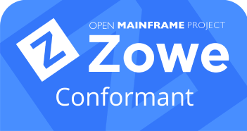

---
---

<!-- SPDX-License-Identifier: CC-BY-4.0 -->
<!-- Copyright Contributors to the Zowe project. -->

<section class="whitebackground" style="float: none;">
  <h1 id="download" style="margin-bottom: 2rem">Extending Zowe</h1>

  

  Zowe is designed to be an extensible tools platform. You can extend it to meet your needs or distribute the plug-ins to users who have already installed Zowe and want to introduce new functionality to it.

  
You can extend Zowe in the following ways:

  

  
1. Extend the Zowe Command Line Interface.

  
2. Add a REST API service to the API Mediation Layer.

  
3. Add a plug-in to the Zowe Desktop.

  

  
Learn more and get started with the <a href="{{ site.zowe_extend_doc_url }}">Extending documentation</a>.

  

    <h2 style="margin-bottom: 1.5rem">Why Build With Zowe?</h2>
      
Building your product or extension on top of Zowe has many advantages! Here are a few:

      

        
<strong>Advanced Security</strong> - Zowe has multifactor authentication built in, ensuring your product keeps with modern security standards.

        
<strong>Modern DevOps Practices</strong> - automate your CI/CD pipeline with modern tools like Jenkins.

        
<strong>Aligned With New Developers</strong> - the next generation of mainframe developers is using Zowe, and will be the ones who implement and use your extension.

      

      
Learn more and get started with the <a href="{{ site.zowe_extend_doc_url }}">Extending documentation</a>.

  

  <section style="padding-top: 3%;">
    <h2 style="margin-bottom: 1.5rem;">Zowe Conformance Program</h2>
    

      

        
Administered by the Open Mainframe Project, the Zowe Conformance Program gives users the confidence that when they use a product, app, or distribution that extends Zowe, they can expect a high level of common functionality, interoperability, and user experience.

        
As a vendor, getting a Zowe Conformance Badge for your application also ensures that your extension will continue to be supported as Zowe changes and grows.

        
Getting a Zowe Conformance Badge happens in 3 steps:

        
      

      

        
      

    

    
Learn more at the<a href="{{ site.conformance_page_url }}">&nbsp;Zowe Conformance website</a>.

  </section>
</section>
