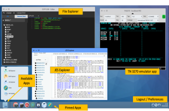
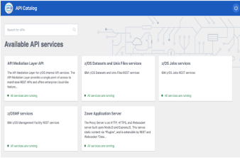
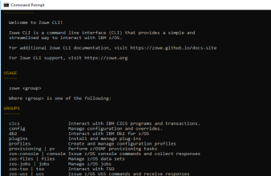
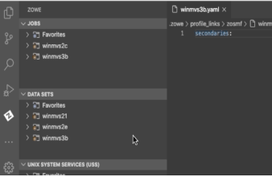

---
redirect_from:
  - "/home"
  - "/home/"
---

<!-- SPDX-License-Identifier: CC-BY-4.0 -->
<!-- Copyright Contributors to the Zowe project. -->

  <h1>Announcements</h1>
  <!-- 

    <strong>New Build: </strong>Zowe {{ site.data.releases[0].version }} is now available. Install it from <a href="/download">here</a>, and check out the Release notes <a href="{{ site.docs_site_url }}/{{site.data.releases[0].documentation}}/getting-started/summaryofchanges.html">here</a>.
  

  

    <strong>Upcoming Events: </strong>Join the Quaterly Webinar to learn about the present and future of Zowe - find out more <a href="{{}}">here</a>
  

  

    <strong>New Features: </strong>
  
 -->
  <strong>Zowe {{ site.data.releases[0].version }} is now available. You can download the installers and PTFs ({{ site.data.releases[0].smpe_numbers }}) for this release from the <a href="/download">Download</a> page. To learn what's new in this release, see the <a href="{{ site.docs_site_url }}/{{site.data.releases[0].documentation}}/getting-started/summaryofchanges.html">Release notes</a>. </strong>
  
    
    <strong>{{ announcement.announcement }}
      
        <a href="{{ announcement.link }}">Learn More</a>
      
       
    </strong>
    
  

  <h1 id="conformance">Welcome to Zowe</h1>
  <h4 style="">Combining the past and the present to build the future of mainframe</h4>
  <h5 style="margin-top: 5%;">A Linux Foundation project</h5>

  

    
Zowe offers modern interfaces that allow you to work with z/OS in a similar way to what you experience on modern cloud platforms. You can use these interfaces as delivered or through plug-ins and extensions that are created by clients or third-party vendors.
    

     
    
Zowe is an open source project created to further technologies that benefit the Z platform from all members of the Z community. Like Mac OS or Windows, Zowe comes with a set of APIs and OS capabilities that applications build on and also includes some applications out of the box.
    

  

  

    <object style="width:100%;height:330px;width:100%; float: none; clear: both; margin: 2px auto;" data="{{ site.  latest_video_embed }}">
    </object>
  

  

    

      
      <h6 style="margin-bottom: 0rem" id="cli-downloads"></h6>
      <h6>Zowe CLI Downloads</h6>
    

    

      
      <h6 style="margin-bottom: 0rem" id="explorer-downloads"></h6>
      <h6>Zowe Explorer Downloads</h6>
    

    

      
      <h6 style="margin-bottom: 0rem" id="server-downloads"></h6>
      <h6>Zowe Build Downloads</h6>
    

  

  

    

      
      <h6 style="margin-bottom: 0rem">33000</h6>
      <h6>Slack Community Members</h6>
    

    

      
      <h6 style="margin-bottom: 0rem" id="github-contributors"></h6>
      <h6>Open Source Contributors</h6>
    

    

      
      <h6 style="margin-bottom: 0rem" id="conformant-product-value"></h6>
      <h6>Vendor Products</h6>
    

  

  

    <h2 style="color: black !important">How Mainframers Use Zowe</h2>
    
Zowe is made up of several products, each improving the learning ability, accessibility, and possibility of mainframe development.
    

  

  

    

      

        <h4>Zowe Application Framework</h4>
        
A web user interface (UI) providing a virtual desktop containing a number of apps allowing access to z/OS function. Includes apps for traditional access such as a 3270 terminal and a VT Terminal, as well as an editor and explorers for working with JES, MVS Data Sets and Unix System Services.
        

        

          <a href="{{ site.ibm_ztrial_url }}">Case Study</a>&nbsp;|&nbsp;
          <a href="{{ site.ibm_ztrial_url }}">Documentation</a>&nbsp;|&nbsp;
          <a href="{{ site.ibm_ztrial_url }}">Code on Github</a>
        

      

      

        
      

    

    

      

        
      

      

        <h4>API Mediation Layer</h4>
          
A single point of access for mainframe service REST APIs, offering enterprise, cloud-like features such as high-availability, scalability, dynamic API discovery, consistent security, SSO, and documentation. Includes core services for working with MVS Data Sets, JES, and z/OSMF REST APIs.

          

            <a href="{{ site.ibm_ztrial_url }}">Case Study</a>&nbsp;|&nbsp;
            <a href="{{ site.ibm_ztrial_url }}">Documentation</a>&nbsp;|&nbsp;
            <a href="{{ site.ibm_ztrial_url }}">Code on Github</a>
          

      

    

    

      

        <h4>Zowe CLI</h4>
        
A command line interface enabling remote mainframe interaction and use of common tools such as IDEs, shell commands, bash scripts, and build tools for mainframe development. It provides a set of utilities and services for application developers who want to become efficient in supporting and building z/OS applications quickly.

          

            <a href="{{ site.ibm_ztrial_url }}">Case Study</a>&nbsp;|&nbsp;
            <a href="{{ site.ibm_ztrial_url }}">Documentation</a>&nbsp;|&nbsp;
            <a href="{{ site.ibm_ztrial_url }}">Code on Github</a>
          

      

      

        
      

    

    

      

        
      

      

        <h4>Zowe Explorer</h4>
          
A VS Code IDE extension enabling mainframe development using modern tooling by accessing USS files, datasets, and jobs that are stored on z/OS mainframes. The extension installs directly from VS Code, and complements the Zowe CLI experience.

          

            <a href="{{ site.ibm_ztrial_url }}">Case Study</a>&nbsp;|&nbsp;
            <a href="{{ site.ibm_ztrial_url }}">Documentation</a>&nbsp;|&nbsp;
            <a href="{{ site.ibm_ztrial_url }}">Code on Github</a>
          

      

    

  

  

    <h2 class="text-center" style="color: black !important; margin-bottom: 5%">What Would You Like To Do With Zowe?</h2>
    

      

        <a href="/learn"><button type="button" class="btn btn-primary btn-lg btn-block">Learn</button></a>
        
Learn how Zowe works and what it can do for you

      

      

        <a href="https://docs.zowe.org/"><button type="button" class="btn btn-primary btn-lg btn-block">Use</button></a>
        
Get started with installing and using Zowe

      

      

        <a href="/extend"><button type="button" class="btn btn-primary btn-lg btn-block">Extend</button></a>
        
Build the next generation of mainframe tooling on top of Zowe

      

      

        <a href="/contribute"><button type="button" class="btn btn-primary btn-lg btn-block">Contribute</button></a>
        
Contribute to the open source community developing Zowe

      

    

  

  

    

      
      

