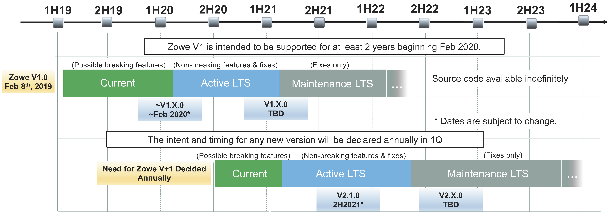
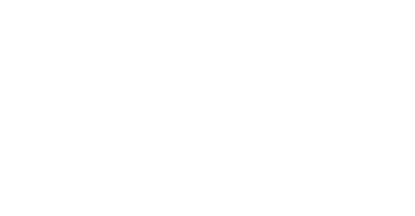

---
redirect_from:
  - "/home"
  - "/home/"
---
<!-- SPDX-License-Identifier: CC-BY-4.0 -->
<!-- Copyright Contributors to the Zowe project. -->

<h1>Announcements</h1>
<strong>Zowe {{ site.data.releases[0].version }} is now available. See <a href="{{ site.docs_site_url }}/{{site.data.releases[0].documentation}}/getting-started/summaryofchanges.html">What's New</a>. </strong>


<strong>{{ announcement.announcement }}

 <a href="{{ announcement.link }}">Learn More</a>

 </strong>



<section class="whitebackground" style="padding-top:1%">

<h1 id="what-is-zowe">What is Zowe?</h1>

Zowe is an open source project created to host technologies that benefit the Z platform from all members of the Z community (Integrated Software Vendors, System Integrators and z/OS consumers). Zowe, like Mac OS or Windows, comes with a set of APIs and OS capabilities that applications build on and also includes some applications out of the box.

Zowe offers modern interfaces to interact with z/OS and allows you to work with z/OS in a way that is similar to what you experience on cloud platforms today. You can use these interfaces as delivered or through plug-ins and extensions that are created by clients or third-party vendors.

Zowe consists of the following main components.

<b>Zowe Application Framework:</b> A web user interface (UI) that provides a virtual desktop containing a number of apps allowing access to z/OS function.  Base Zowe includes apps for traditional access such as a 3270 terminal and a VT Terminal, as well as an editor and explorers for working with JES, MVS Data Sets and Unix System Services.

<b>API Mediation Layer:</b> Provides a gateway that acts as a reverse proxy for z/OS services, together with a catalog of REST APIs and a dynamic discovery capability. Base Zowe provides core services for working with MVS Data Sets, JES, as well as working with z/OSMF REST APIs. The API Mediation Layer also provides a framework for Single Sign On (SSO). 

<b>Zowe CLI:</b> Provides a command-line interface that lets you interact with the mainframe remotely and use common tools such as Integrated Development Environments (IDEs), shell commands, bash scripts, and build tools for mainframe development. It provides a set of utilities and services for application developers that want to become efficient in supporting and building z/OS applications quickly. The CLI provides a core set of commands for working with data sets, USS, JES, as well as issuing TSO and console commands.

<object style="width:100%;height:330px;width:100%; float: none; clear: both; margin: 2px auto;" data="{{ site.latest_video_embed }}">
</object>

</section>

<section class="bluebackground">

<h1 id="download">Download</h1>

The easiest way to get started with Zowe is by downloading the convenience build. You can also go to the GitHub repository to build Zowe on your own.

<a class="button" href="{{ site.zos_download_url }}{{ site.data.releases[0].version }}">Zowe {{ site.data.releases[0].version }} z/OS Components</a>
<a class="button" href="{{ site.cli_download_url }}{{ site.data.releases[0].version }}">Zowe {{ site.data.releases[0].version }} CLI</a>
<a class="button" href="{{ site.github_repo_url }}">Zowe GitHub repositories</a>

<b>Past Releases</b>


  
  <table>
  
  
  <tr>
    <td>Zowe {{release.version}} ({{release.release_date}})</td>
    <td><a href="{{site.zos_download_url}}{{release.version}}">Zowe z/OS Components</a></td>
    <td><a href="{{site.cli_download_url}}{{release.version}}">Zowe Command Line Interface</a></td>
    <td><a href="{{ site.docs_site_url }}/{{release.documentation}}/getting-started/summaryofchanges.html">Release Notes</a></td>
    <td><a href="{{ site.docs_site_url }}/{{release.documentation}}">Documentation</a></td>
  </tr>
  
  
  </table>
  <i>All builds prior to Zowe v1.0.0 are no longer available.</i>
  


<b>Nightly Builds</b>

Visit the Zowe Artifactory <a class="white" href="{{ site.nightly_build_url }}">nightly build folder</a> to find the most recent build.

Please note:
  <ul>
    <li><i>Nightly builds are made available to allow preview and early distribution of in-progress work items which may be functionally incomplete and unstable. The coverage and successful execution of tests has not been guaranteed and the builds should be treated accordingly.</i></li>
    <li><i>The latest build status is available from <a class="white" href="{{ site.zowe_build_slack_url }}">#zowe-build Slack channel</a>.</i></li>
    <li><i>A nightly build will be removed about 30 days after release.</i></li>
  </ul>



<b>Pre-Release Builds</b>

If you want to try newer, actively-developed Zowe features and functions, download the following packages:


<a class="button" href="{{ site.smpe_download_url }}{{ site.data.releases[0].version }}alpha1">Zowe {{ site.data.releases[0].version }} SMP/E Alpha</a>


<a class="button" href="{{ site.cli_active_development_download_url }}{{ site.data.active_development.cli.version }}&package={{ site.data.active_development.cli.package }}">Zowe CLI (Active Development)</a>




<i>
* Please note the Zowe binaries are made available to you by Zowe Binary Projects a Series of LF Projects, LLC, and not by The Linux Foundation or the Open Mainframe Project.
</i>

<b>Zowe Support Policy</b>

Check out the Zowe Long Term Support (TLS) schedule for releases.

<b>Version timeframe, Current, Active LTS, Maintenance</b>

<ul>
<li>New Zowe versions will enter <b>current</b> release status for six to nine months to allow consumers of Zowe to test, provide feedback, and adjust to any changes.</li>
<li>After current release phase, Zowe will move to <b>Active LTS</b> status and will be deemed ready by the community for general use. <b>Active LTS</b> will have additional releases with both fixes and enhancements.</li>
<li>Following a period of <b>Active LTS</b>, the Zowe version will enter <b>Maintenance</b> for fixes only.</li>
<li>The combination of <b>Active LTS</b> and <b>Maintenance LTS</b> release is designated as <b>"long-term support”</b>, which provides two guarantees:
  <ul>
    <li>Critical defects will be fixed. The criteria for what constitutes a critical defect is covered in <a href="{{ site.lts_url }}">Release Process</a>.</li>
    <li>Extenders who achieve Zowe conformance for the long-term support version will not need to modify their product for it to remain functional when the Zowe community provides distributions within the release or  modification level boundary within the same version.</li>
  </ul>
</li>
<li>The length of <b>Active LTS</b> may vary but the total time period of <b>Active LTS</b> + <b>Maintenance LTS</b> will be at least 24 months.</li>
<li>Production applications should only use <b>Active LTS</b> or <b>Maintenance LTS</b> releases due to the contract with extender products remaining functional and the community’s commitment to fix critical defects.</li>
</ul>
<a class="button" href="{{ site.lts_url }}">Learn more</a>

If you don't have infrastructure to install Zowe locally, you can use the Zowe Trial hosted by IBM. This no-charge trial is available in two hours for three days.

<a class="button" href="{{ site.ibm_ztrial_url }}">Request a trial</a>

<i>* By proceeding to the trial, you will be leaving the Zowe.org website.</i>

</section>

<section class="whitebackground">

<h1 id="community">Community</h1>

Zowe is more than a framework - it's a worldwide community of developers, vendors, and users building and extending Zowe. Discover how you can connect, learn, and contribute to its future.

<a class="button" href="{{ site.community_site_url }}">Learn more</a>

</section>

<section class="bluebackground">

<h1 id="conformance">Zowe Conformance Program</h1>

The Zowe Conformance Program aims to give users the confidence that when they use a product, app, or distribution that leverages Zowe they can expect a high level of common functionality, interoperability and user experience.

<a class="button" href="{{ site.conformance_page_url }}">Learn more</a>

