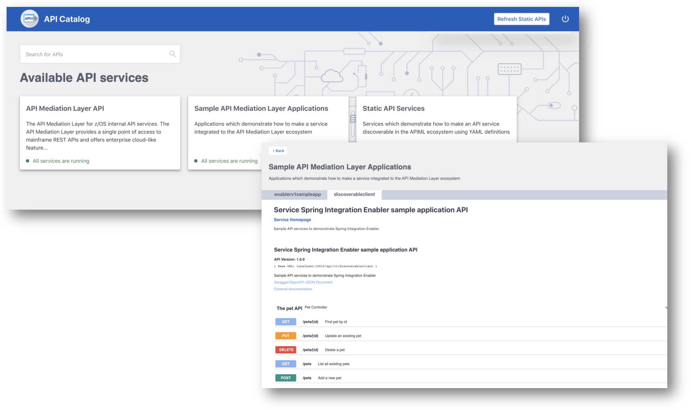
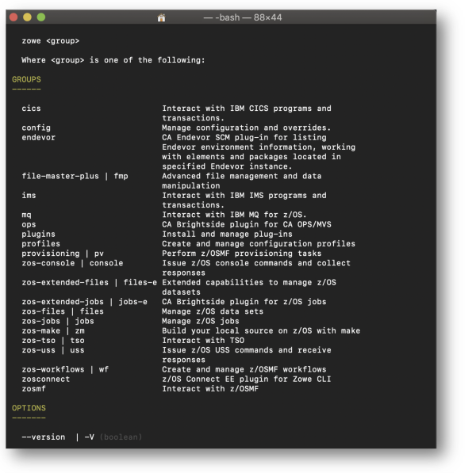
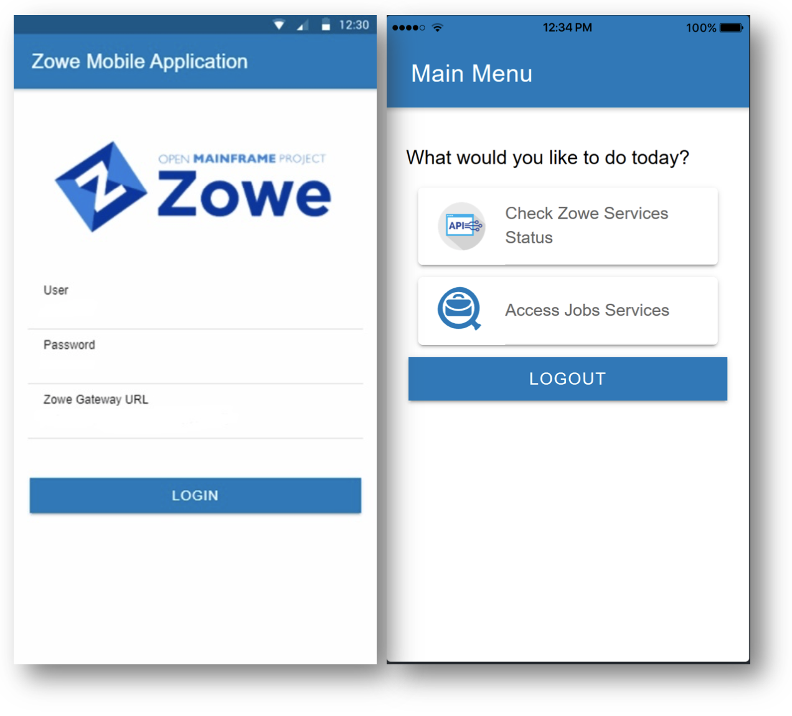
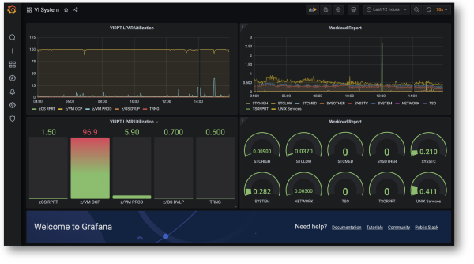

---
redirect_from:
  - "/home"
  - "/home/"
---

<!-- SPDX-License-Identifier: CC-BY-4.0 -->
<!-- Copyright Contributors to the Zowe project. -->

  <h1>Announcements</h1>
  <!-- 

    <strong>New Build: </strong>Zowe {{ site.data.releases[0].version }} is now available. Install it from <a href="/download">here</a>, and check out the Release notes <a href="{{ site.docs_site_url }}/{{site.data.releases[0].documentation}}/getting-started/summaryofchanges.html">here</a>.
  

  

    <strong>Upcoming Events: </strong>Join the Quaterly Webinar to learn about the present and future of Zowe - find out more here
  

  

    <strong>New Features: </strong>
  
 -->
  <strong>Zowe {{ site.data.releases[0].version }} is now available. You can download the installers and PTFs ({{ site.data.releases[0].smpe_numbers }}) for this release from the <a href="/download">Download</a> page. To learn what's new in this release, see the <a href="{{ site.docs_site_url }}/{{site.data.releases[0].documentation}}/getting-started/summaryofchanges.html">Release notes</a>. </strong>
  
    
    

    <strong>{{ announcement.announcement }}
      
        <a href="{{ announcement.link }}">Learn More</a>
      
       
    </strong>
    
  

 
  <h1 id="conformance" style="margin-bottom: 2%">Open, Simple, Familiar</h1>
  <h4 style="">Combining the past and the present to build the future of mainframe</h4>

  

    
Zowe is an integrated and extensible open source framework for z/OS. Zowe, like Mac OS or Windows, comes with a set of APIs and OS capabilities that applications build on and also includes some applications out of the box. 
    

     
    
Zowe offers modern interfaces to interact with z/OS and allows you to work with z/OS in a way that is similar to what you experience on cloud platforms today. You can use these interfaces as delivered or through plug-ins and extensions that are created by clients or third-party vendors. 
    

    
Zowe is composed of several components, each improving the learning ability, accessibility, and possibility of mainframe development.

    

      <a href="#app-framework-intro" class="card-link" style="margin-left: 1.25rem">
      <svg width="1em" height="1em" viewBox="0 0 16 16" class="bi bi-arrow-right-circle" fill="currentColor" xmlns="http://www.w3.org/2000/svg"> <path fill-rule="evenodd" d="M8 15A7 7 0 1 0 8 1a7 7 0 0 0 0 14zm0 1A8 8 0 1 0 8 0a8 8 0 0 0 0 16z"/> <path fill-rule="evenodd" d="M7.646 11.354a.5.5 0 0 1 0-.708L10.293 8 7.646 5.354a.5.5 0 1 1 .708-.708l3 3a.5.5 0 0 1 0 .708l-3 3a.5.5 0 0 1-.708 0z"/> <path fill-rule="evenodd" d="M4.5 8a.5.5 0 0 1 .5-.5h5a.5.5 0 0 1 0 1H5a.5.5 0 0 1-.5-.5z"/></svg>
      Zowe Application Framework
      </a>
      <a href="#apiml-intro" class="card-link">
      <svg width="1em" height="1em" viewBox="0 0 16 16" class="bi bi-arrow-right-circle" fill="currentColor" xmlns="http://www.w3.org/2000/svg"> <path fill-rule="evenodd" d="M8 15A7 7 0 1 0 8 1a7 7 0 0 0 0 14zm0 1A8 8 0 1 0 8 0a8 8 0 0 0 0 16z"/> <path fill-rule="evenodd" d="M7.646 11.354a.5.5 0 0 1 0-.708L10.293 8 7.646 5.354a.5.5 0 1 1 .708-.708l3 3a.5.5 0 0 1 0 .708l-3 3a.5.5 0 0 1-.708 0z"/> <path fill-rule="evenodd" d="M4.5 8a.5.5 0 0 1 .5-.5h5a.5.5 0 0 1 0 1H5a.5.5 0 0 1-.5-.5z"/></svg>
      Zowe API Mediation Layer
      </a>
      <a href="#cli-intro" class="card-link">
      <svg width="1em" height="1em" viewBox="0 0 16 16" class="bi bi-arrow-right-circle" fill="currentColor" xmlns="http://www.w3.org/2000/svg"> <path fill-rule="evenodd" d="M8 15A7 7 0 1 0 8 1a7 7 0 0 0 0 14zm0 1A8 8 0 1 0 8 0a8 8 0 0 0 0 16z"/> <path fill-rule="evenodd" d="M7.646 11.354a.5.5 0 0 1 0-.708L10.293 8 7.646 5.354a.5.5 0 1 1 .708-.708l3 3a.5.5 0 0 1 0 .708l-3 3a.5.5 0 0 1-.708 0z"/> <path fill-rule="evenodd" d="M4.5 8a.5.5 0 0 1 .5-.5h5a.5.5 0 0 1 0 1H5a.5.5 0 0 1-.5-.5z"/></svg>
      Zowe CLI
      </a>
      <a href="#zowe-explorer-intro" class="card-link">
      <svg width="1em" height="1em" viewBox="0 0 16 16" class="bi bi-arrow-right-circle" fill="currentColor" xmlns="http://www.w3.org/2000/svg"> <path fill-rule="evenodd" d="M8 15A7 7 0 1 0 8 1a7 7 0 0 0 0 14zm0 1A8 8 0 1 0 8 0a8 8 0 0 0 0 16z"/> <path fill-rule="evenodd" d="M7.646 11.354a.5.5 0 0 1 0-.708L10.293 8 7.646 5.354a.5.5 0 1 1 .708-.708l3 3a.5.5 0 0 1 0 .708l-3 3a.5.5 0 0 1-.708 0z"/> <path fill-rule="evenodd" d="M4.5 8a.5.5 0 0 1 .5-.5h5a.5.5 0 0 1 0 1H5a.5.5 0 0 1-.5-.5z"/></svg>
      Zowe Explorer
      </a>
      <a href="#zowe-client-sdk-intro" class="card-link">
      <svg width="1em" height="1em" viewBox="0 0 16 16" class="bi bi-arrow-right-circle" fill="currentColor" xmlns="http://www.w3.org/2000/svg"> <path fill-rule="evenodd" d="M8 15A7 7 0 1 0 8 1a7 7 0 0 0 0 14zm0 1A8 8 0 1 0 8 0a8 8 0 0 0 0 16z"/> <path fill-rule="evenodd" d="M7.646 11.354a.5.5 0 0 1 0-.708L10.293 8 7.646 5.354a.5.5 0 1 1 .708-.708l3 3a.5.5 0 0 1 0 .708l-3 3a.5.5 0 0 1-.708 0z"/> <path fill-rule="evenodd" d="M4.5 8a.5.5 0 0 1 .5-.5h5a.5.5 0 0 1 0 1H5a.5.5 0 0 1-.5-.5z"/></svg>
      Zowe Client SDKs - under development
      </a>
      <a href="#zowe-mobile-intro" class="card-link">
      <svg width="1em" height="1em" viewBox="0 0 16 16" class="bi bi-arrow-right-circle" fill="currentColor" xmlns="http://www.w3.org/2000/svg"> <path fill-rule="evenodd" d="M8 15A7 7 0 1 0 8 1a7 7 0 0 0 0 14zm0 1A8 8 0 1 0 8 0a8 8 0 0 0 0 16z"/> <path fill-rule="evenodd" d="M7.646 11.354a.5.5 0 0 1 0-.708L10.293 8 7.646 5.354a.5.5 0 1 1 .708-.708l3 3a.5.5 0 0 1 0 .708l-3 3a.5.5 0 0 1-.708 0z"/> <path fill-rule="evenodd" d="M4.5 8a.5.5 0 0 1 .5-.5h5a.5.5 0 0 1 0 1H5a.5.5 0 0 1-.5-.5z"/></svg>
      Zowe Mobile - Incubator
      </a>
      <a href="#zebra-intro" class="card-link">
      <svg width="1em" height="1em" viewBox="0 0 16 16" class="bi bi-arrow-right-circle" fill="currentColor" xmlns="http://www.w3.org/2000/svg"> <path fill-rule="evenodd" d="M8 15A7 7 0 1 0 8 1a7 7 0 0 0 0 14zm0 1A8 8 0 1 0 8 0a8 8 0 0 0 0 16z"/> <path fill-rule="evenodd" d="M7.646 11.354a.5.5 0 0 1 0-.708L10.293 8 7.646 5.354a.5.5 0 1 1 .708-.708l3 3a.5.5 0 0 1 0 .708l-3 3a.5.5 0 0 1-.708 0z"/> <path fill-rule="evenodd" d="M4.5 8a.5.5 0 0 1 .5-.5h5a.5.5 0 0 1 0 1H5a.5.5 0 0 1-.5-.5z"/></svg>
      ZEBRA (Zowe Embedded Browser for RMF/SMF and APIs) - Incubator
      </a>
    

  

  

    <iframe title="Introduction to Zowe" src="{{ site. latest_video_embed }}" frameborder="0" allow="accelerometer; autoplay; encrypted-media; gyroscope; picture-in-picture" allowfullscreen style="width: -webkit-fill-available; height: 100%"></iframe>
    

      <a href="{{ site.zowe_video_deck_url }}">Download Slides (.pptx)</a>&nbsp;|&nbsp;
      <a href="{{ site.zowe_video_transcript_url }}">Download Transcript (.txt)</a>
    

  

    <h2 class="text-center" style="color: black !important; margin-bottom: 5%">What would you like to do with Zowe?</h2>
    

      

        <a href="/learn"><button type="button" class="btn btn-primary btn-lg btn-block">Learn</button></a>
        
Learn how Zowe works and what it can do for you

      

      

        <a href="https://docs.zowe.org/stable/user-guide/installandconfig.html"><button type="button" class="btn btn-primary btn-lg btn-block">Use</button></a>
        
Get started with installing and using Zowe

      

      

        <a href="/extend"><button type="button" class="btn btn-primary btn-lg btn-block">Extend</button></a>
        
Build the next generation of mainframe tooling on top of Zowe

      

      

        <a href="/contribute"><button type="button" class="btn btn-primary btn-lg btn-block">Contribute</button></a>
        
Contribute to the open source community developing Zowe

      

    

 

  
  <section id="events" style="margin-top: 3%">
    

      <h2 class="mb-3 text-center">Upcoming events</h2>
      

        
        
 <!-- ml-auto mr-auto -->
          

          
            <h5 class="border-bottom border-primary pb-2"><a href="{{ events.url }}">{{ events.event }}</a></h5>
          
            <h5 class="border-bottom border-primary pb-2">{{ events.event }}</h5>
          
            {{ events.schedule }}
             
            {{ events.description }}
          

        

        
      

    

  </section>
  

  

    <h2 class="text-center" style="color: black !important; margin-bottom: 3%">Zowe components</h2>
  

  

    

      

        <a id="app-framework-intro"><h4>Zowe Application Framework</h4></a>
        
  
        A web user interface (UI) that provides a virtual desktop containing a number of apps allowing access to z/OS function. Base Zowe includes apps for traditional access such as a 3270 terminal and a VT Terminal, as well as an editor and explorers for working with JES, MVS Data Sets and Unix System Services.
        

        

          <a href="{{ site.app_framework_github_url }}">Code on GitHub</a>&nbsp;|&nbsp;
          <a href="{{ site.app_framework_slack_url }}">Connect on Slack</a>&nbsp;|&nbsp;
          <a href="{{ site.app_framework_doc_url }}">Learn more</a>&nbsp;|&nbsp;
          <a href="{{ site.app_framework_tour_url }}">View Tour</a>
        

      

      

        
      

    

    

    

      

        
      

      

        <a id="apiml-intro"><h4>API Mediation Layer</h4></a>
          
Provides a gateway that acts as a reverse proxy for z/OS services, together with a catalog of REST APIs and a dynamic discovery capability. Base Zowe provides core services for working with MVS Data Sets, JES, as well as working with z/OSMF REST APIs. The API Mediation Layer also provides a framework for Single Sign On (SSO). 
          

          

            <a href="{{ site.apiml_github_url }}">Code on GitHub</a>&nbsp;|&nbsp;
            <a href="{{ site.apiml_slack_url }}">Connect on Slack</a>&nbsp;|&nbsp;
            <a href="{{ site.apiml_doc_url }}">Learn more</a>
          

      

    

    

    

      

        <a id="cli-intro"><h4>Zowe CLI</h4></a>
        
Provides a command-line interface that lets you interact with the mainframe remotely and use common tools such as Integrated Development Environments (IDEs), shell commands, bash scripts, and build tools for mainframe development. It provides a set of utilities and services for application developers that want to become efficient in supporting and building z/OS applications quickly. The CLI provides a core set of commands for working with data sets, USS, JES, as well as issuing TSO and console commands.

          

            <a href="{{ site.zowe_cli_github_url }}">Code on GitHub</a>&nbsp;|&nbsp;
            <a href="{{ site.zowe_cli_slack_url }}">Connect on Slack</a>&nbsp;|&nbsp;
            <a href="{{ site.zowe_cli_doc_url }}">Learn more</a>
          

      

      

        
      

    

    

    

      

        
      

      

        <a id="zowe-explorer-intro"><h4>Zowe Explorer</h4></a>
          
A Visual Studio Code extension that modernizes the way developers and system administrators interact with z/OS mainframes. Zowe Explorer lets you interact with data sets, USS files, and jobs that are stored on z/OS. The extension complements your Zowe CLI experience and lets you use authentication services like API Mediation Layer.

          

            <a href="{{ site.zowe_explorer_github_url }}">Code on GitHub</a>&nbsp;|&nbsp;
            <a href="{{ site.zowe_explorer_slack_url }}">Connect on Slack</a>&nbsp;|&nbsp;
            <a href="{{ site.zowe_explorer_doc_url }}">Learn more</a>
          

      

    

    

    

      

        <a id="zowe-client-sdk-intro"><h4>Zowe Client SDKs (under development)</h4></a>
        
Provides access to a set of programmatic APIs that you can use to build client applications or scripts that interact with z/OS. SDKs are available for Node.js and Python.

          

            <a href="{{ site.zowe_sdk_github_url }}">Code on GitHub</a>&nbsp;|&nbsp;
            <a href="{{ site.zowe_sdk_slack_url }}">Connect on Slack</a>&nbsp;|&nbsp;
            <a href="{{ site.zowe_sdk_doc_url }}">Learn more</a>
          

      

      

        
      

    

    

    

      

        
      

      

        <a id="zowe-mobile-intro"><h4>Zowe Mobile (Incubator)</h4></a>
          
Lets you interact with your Zowe instance running on the mainframe from your mobile. 

          

            <a href="{{ site.zowe_mobile_github_url }}">Code on GitHub</a>&nbsp;|&nbsp;
            <a href="{{ site.zowe_mobile_slack_url }}">Connect on Slack</a>&nbsp;|&nbsp;
            <a href="{{ site.zowe_mobile_doc_url }}">Learn more</a>
          

      

    

    

    

      

        <a id="zebra-intro"><h4>ZEBRA (Incubator)</h4></a>
        
Provides re-usable and industry compliant JSON formatted RMF/SMF data records, so that many other ISV SW and users can exploit them using open-source SW for many ways.

          

            <a href="{{ site.zebra_github_url }}">Code on GitHub</a>&nbsp;|&nbsp;
            <a href="{{ site.zebra_slack_url }}">Connect on Slack</a>&nbsp;|&nbsp;
            <a href="{{ site.zebra_doc_url }}">Learn more</a>
          

      

      

        
      

    

  

 
<h2 class="text-center" style="color: black !important; margin-bottom: 5%">Zowe by the numbers</h2>
  

    

      <a style="color: initial; text-decoration: none" href="{{ site.zowe_metrics_url }}">
        <h3 style="margin-bottom: 0rem" id="cli-downloads"></h3>
        <h6>Zowe CLI Downloads</h6>
      </a>
    

    

      <a style="color: initial; text-decoration: none" href="{{ site.vscode_marketplace_url }}">
        <h3 style="margin-bottom: 0rem" id="explorer-downloads"></h3>
        <h6>Zowe Explorer Downloads</h6>
      </a>
    

    

      <a style="color: initial; text-decoration: none" href="{{ site.zowe_metrics_url }}">
        <h3 style="margin-bottom: 0rem" id="server-downloads"></h3>
        <h6>Zowe z/OS Build Downloads</h6>
      </a>
    

  

  

    

      <a style="color: initial; text-decoration: none" href="{{ site.slack_url }}">
        <h3 style="margin-bottom: 0rem" id="slack-members"></h3>
        <h6>Slack Community Members</h6>
      </a>
    

    

      <a style="color: initial; text-decoration: none" href="{{ site.github_repo_url }}">
        <h3 style="margin-bottom: 0rem" id="github-contributors"></h3>
        <h6>Contributors</h6>
      </a>
    

    

      <a style="color: initial; text-decoration: none" href="{{ site.conformance_page_url }}">
        <h3 style="margin-bottom: 0rem" id="conformant-product-value"></h3>
        <h6>Zowe Conformant Products</h6>
      </a>
    

  

  

    <a href="{{ site.zowe_metrics_url }}"><h5 class="text-right"><svg width="1em" height="1em" viewBox="0 0 16 16" class="bi bi-arrow-right-circle" fill="currentColor" xmlns="http://www.w3.org/2000/svg"> <path fill-rule="evenodd" d="M8 15A7 7 0 1 0 8 1a7 7 0 0 0 0 14zm0 1A8 8 0 1 0 8 0a8 8 0 0 0 0 16z"/> <path fill-rule="evenodd" d="M7.646 11.354a.5.5 0 0 1 0-.708L10.293 8 7.646 5.354a.5.5 0 1 1 .708-.708l3 3a.5.5 0 0 1 0 .708l-3 3a.5.5 0 0 1-.708 0z"/> <path fill-rule="evenodd" d="M4.5 8a.5.5 0 0 1 .5-.5h5a.5.5 0 0 1 0 1H5a.5.5 0 0 1-.5-.5z"/></svg> Check out more Zowe community metrics</h5></a>
  

  

    <h2 class="text-center" style="color: black !important; margin-bottom: 5%">From Zowe blog</h2>
  

  

    
    
  

    <a href="{{ site.zowe_medium_blog_url }}"><h5 class="text-right"><svg width="1em" height="1em" viewBox="0 0 16 16" class="bi bi-arrow-right-circle" fill="currentColor" xmlns="http://www.w3.org/2000/svg"> <path fill-rule="evenodd" d="M8 15A7 7 0 1 0 8 1a7 7 0 0 0 0 14zm0 1A8 8 0 1 0 8 0a8 8 0 0 0 0 16z"/> <path fill-rule="evenodd" d="M7.646 11.354a.5.5 0 0 1 0-.708L10.293 8 7.646 5.354a.5.5 0 1 1 .708-.708l3 3a.5.5 0 0 1 0 .708l-3 3a.5.5 0 0 1-.708 0z"/> <path fill-rule="evenodd" d="M4.5 8a.5.5 0 0 1 .5-.5h5a.5.5 0 0 1 0 1H5a.5.5 0 0 1-.5-.5z"/></svg> Check our other blogs</h5></a>
  

    

  
  

