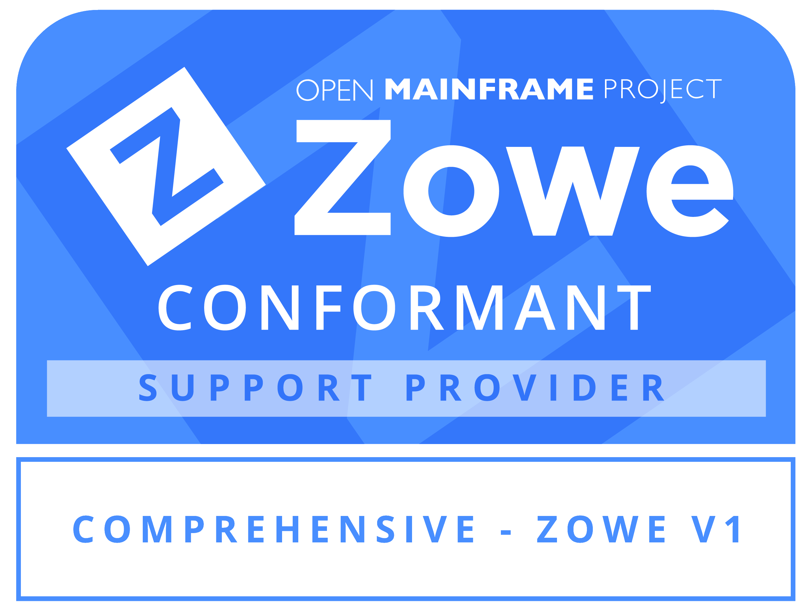
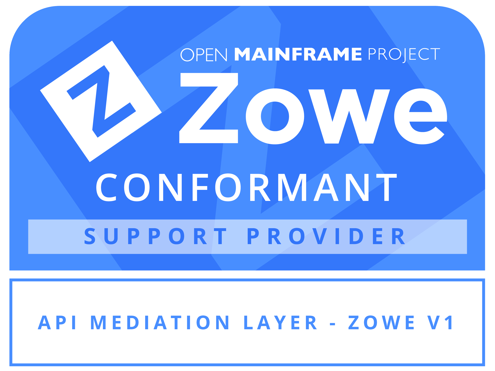
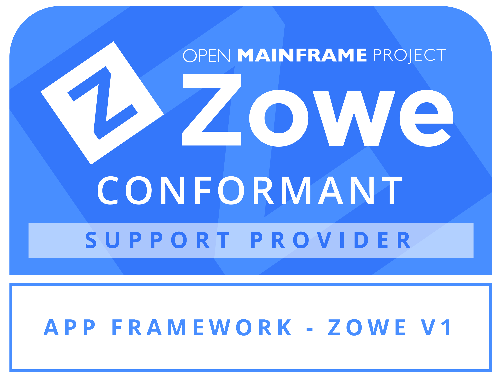
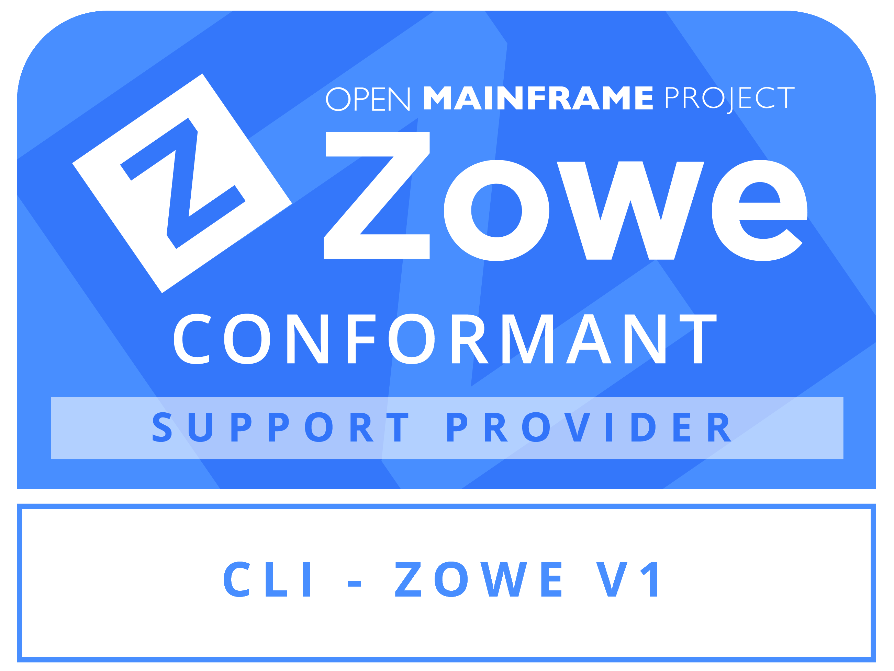
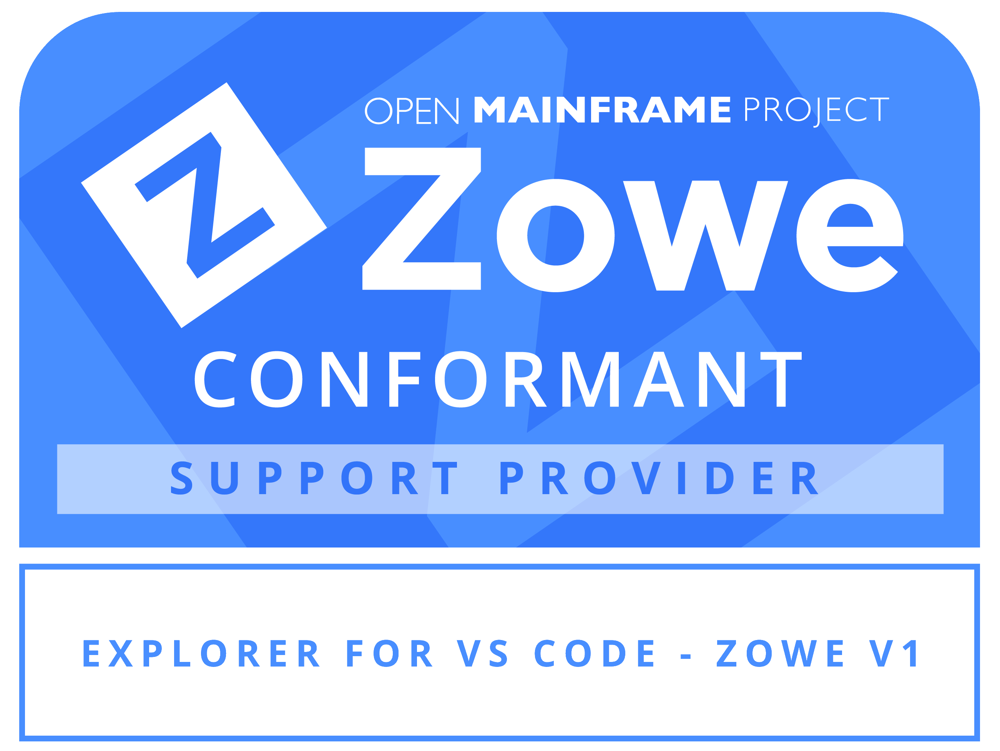

---
---

<!-- SPDX-License-Identifier: CC-BY-4.0 -->
<!-- Copyright Contributors to the Zowe project. -->

<section class="whitebackground" style="float: none;">
  <h1 id="download" style="margin-bottom: 2rem">Zowe Conformant Support Provider Program</h1>
  
The Zowe Support Provider Conformance Program gives vendors the ability to showcase their Zowe support competencies. Applicants self-attest to criteria defined by the Zowe Technical Steering Committee designed to provide consumers with the confidence they need to use Zowe in business-critical environments. Like Zowe, the Zowe Support Provider Conformance Program will continue to evolve.
  

  
The Zowe Support Provider Conformance Program is administered by the Linux Foundation and Open Mainframe Project staff.  All vendors are invited to submit their self-attestation results for review and approval in confidence by the Linux Foundation and Open Mainframe Project staff. If your company strives to be able to support Zowe for your customers, we encourage you to become a Zowe Conformant Support Provider today.

  <section style="padding-top: 3%;">
    <h2 style="margin-bottom: 1.5rem;">How to participate</h2>
        
 
          

            

              <a class="col-md-3" href="{{ site.conformance_support_step1_url }}"><button type="button" class="btn btn-primary btn-lg btn-block" style="white-space: break-spaces">1) Review program terms and conditions</button></a>
            

            

              <a class="col-md-3" href="{{ site.conformance_support_step2_url }}"><button type="button" class="btn btn-primary btn-lg btn-block" style="white-space: break-spaces">2) Complete test evaluation guide</button></a>
            

            

              <a class="col-md-3" href="{{ site.conformance_support_step3_url }}"><button type="button" class="btn btn-primary btn-lg btn-block" style="white-space: break-spaces">3) Submit the participation form</button></a>
            

         

         
Learn more about the program at the <a href="{{ site.conformance_support_page_url }}">&nbsp;Zowe Conformant Support Provider Program website</a>.

       

  </section>
  <section style="padding-top: 3%;">
  <h2 style="margin-bottom: 1.5rem;">Look for vendors that proudly display the Zowe Conformant Support Provider Program logo</h2>
  
 
  

    

      
    

    

      
    

    

      
    

    

      
    

    

      
    
  
  

  

	

		<h2 style="margin-bottom: 1.5rem; padding-top: 3%;">The following vendors are Zowe Conformant Support Providers.</h2>
    <iframe frameBorder="0" id="landscape" scrolling="no" style="width: 1px; min-width: 100%" src="https://landscape.openmainframeproject.org/pages/zowe-conformant-support-vendor"></iframe>
	

  </section>
</section>
