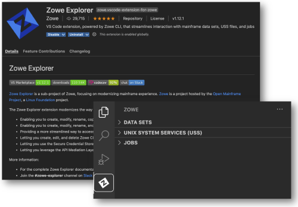
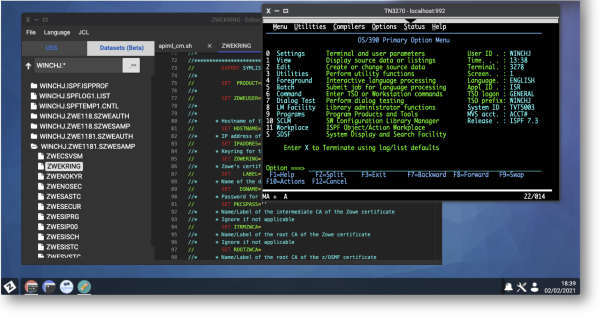

---
---

<!-- SPDX-License-Identifier: CC-BY-4.0 -->
<!-- Copyright Contributors to the Zowe project. -->

<section class="whitebackground">
  <h1 id="download" style="margin-bottom: 1.5rem">Table of Contents</h1>

  

      <a href="#latest-announcements" class="card-link" style="margin-left: 1.25rem">
      <svg width="1em" height="1em" viewBox="0 0 16 16" class="bi bi-arrow-right-circle" fill="currentColor" xmlns="http://www.w3.org/2000/svg"> <path fill-rule="evenodd" d="M8 15A7 7 0 1 0 8 1a7 7 0 0 0 0 14zm0 1A8 8 0 1 0 8 0a8 8 0 0 0 0 16z"/> <path fill-rule="evenodd" d="M7.646 11.354a.5.5 0 0 1 0-.708L10.293 8 7.646 5.354a.5.5 0 1 1 .708-.708l3 3a.5.5 0 0 1 0 .708l-3 3a.5.5 0 0 1-.708 0z"/> <path fill-rule="evenodd" d="M4.5 8a.5.5 0 0 1 .5-.5h5a.5.5 0 0 1 0 1H5a.5.5 0 0 1-.5-.5z"/></svg>
      Latest Announcements 
      </a>
      <a href="#coming-changes" class="card-link">
      <svg width="1em" height="1em" viewBox="0 0 16 16" class="bi bi-arrow-right-circle" fill="currentColor" xmlns="http://www.w3.org/2000/svg"> <path fill-rule="evenodd" d="M8 15A7 7 0 1 0 8 1a7 7 0 0 0 0 14zm0 1A8 8 0 1 0 8 0a8 8 0 0 0 0 16z"/> <path fill-rule="evenodd" d="M7.646 11.354a.5.5 0 0 1 0-.708L10.293 8 7.646 5.354a.5.5 0 1 1 .708-.708l3 3a.5.5 0 0 1 0 .708l-3 3a.5.5 0 0 1-.708 0z"/> <path fill-rule="evenodd" d="M4.5 8a.5.5 0 0 1 .5-.5h5a.5.5 0 0 1 0 1H5a.5.5 0 0 1-.5-.5z"/></svg>
      Coming changes to the functionality
      </a>
      <a href="#conformance-changes" class="card-link">
      <svg width="1em" height="1em" viewBox="0 0 16 16" class="bi bi-arrow-right-circle" fill="currentColor" xmlns="http://www.w3.org/2000/svg"> <path fill-rule="evenodd" d="M8 15A7 7 0 1 0 8 1a7 7 0 0 0 0 14zm0 1A8 8 0 1 0 8 0a8 8 0 0 0 0 16z"/> <path fill-rule="evenodd" d="M7.646 11.354a.5.5 0 0 1 0-.708L10.293 8 7.646 5.354a.5.5 0 1 1 .708-.708l3 3a.5.5 0 0 1 0 .708l-3 3a.5.5 0 0 1-.708 0z"/> <path fill-rule="evenodd" d="M4.5 8a.5.5 0 0 1 .5-.5h5a.5.5 0 0 1 0 1H5a.5.5 0 0 1-.5-.5z"/></svg>
      Changes to the Conformance Criteria
      </a>
      <a href="#office-hours" class="card-link">
      <svg width="1em" height="1em" viewBox="0 0 16 16" class="bi bi-arrow-right-circle" fill="currentColor" xmlns="http://www.w3.org/2000/svg"> <path fill-rule="evenodd" d="M8 15A7 7 0 1 0 8 1a7 7 0 0 0 0 14zm0 1A8 8 0 1 0 8 0a8 8 0 0 0 0 16z"/> <path fill-rule="evenodd" d="M7.646 11.354a.5.5 0 0 1 0-.708L10.293 8 7.646 5.354a.5.5 0 1 1 .708-.708l3 3a.5.5 0 0 1 0 .708l-3 3a.5.5 0 0 1-.708 0z"/> <path fill-rule="evenodd" d="M4.5 8a.5.5 0 0 1 .5-.5h5a.5.5 0 0 1 0 1H5a.5.5 0 0 1-.5-.5z"/></svg>
      Office Hours
      </a>
      <a href="#faq-users" class="card-link">
      <svg width="1em" height="1em" viewBox="0 0 16 16" class="bi bi-arrow-right-circle" fill="currentColor" xmlns="http://www.w3.org/2000/svg"> <path fill-rule="evenodd" d="M8 15A7 7 0 1 0 8 1a7 7 0 0 0 0 14zm0 1A8 8 0 1 0 8 0a8 8 0 0 0 0 16z"/> <path fill-rule="evenodd" d="M7.646 11.354a.5.5 0 0 1 0-.708L10.293 8 7.646 5.354a.5.5 0 1 1 .708-.708l3 3a.5.5 0 0 1 0 .708l-3 3a.5.5 0 0 1-.708 0z"/> <path fill-rule="evenodd" d="M4.5 8a.5.5 0 0 1 .5-.5h5a.5.5 0 0 1 0 1H5a.5.5 0 0 1-.5-.5z"/></svg>
      Frequently Asked Questions - User focused
      </a>
      <a href="#questions-apiml-users" class="card-link" style="margin-left: 30px;">
      <svg width="1em" height="1em" viewBox="0 0 16 16" class="bi bi-arrow-right-circle" fill="currentColor" xmlns="http://www.w3.org/2000/svg"> <path fill-rule="evenodd" d="M8 15A7 7 0 1 0 8 1a7 7 0 0 0 0 14zm0 1A8 8 0 1 0 8 0a8 8 0 0 0 0 16z"/> <path fill-rule="evenodd" d="M7.646 11.354a.5.5 0 0 1 0-.708L10.293 8 7.646 5.354a.5.5 0 1 1 .708-.708l3 3a.5.5 0 0 1 0 .708l-3 3a.5.5 0 0 1-.708 0z"/> <path fill-rule="evenodd" d="M4.5 8a.5.5 0 0 1 .5-.5h5a.5.5 0 0 1 0 1H5a.5.5 0 0 1-.5-.5z"/></svg>
      API Mediation Layer for Users
      </a>
      <a href="#questions-cli-users" class="card-link" style="margin-left: 30px;">
      <svg width="1em" height="1em" viewBox="0 0 16 16" class="bi bi-arrow-right-circle" fill="currentColor" xmlns="http://www.w3.org/2000/svg"> <path fill-rule="evenodd" d="M8 15A7 7 0 1 0 8 1a7 7 0 0 0 0 14zm0 1A8 8 0 1 0 8 0a8 8 0 0 0 0 16z"/> <path fill-rule="evenodd" d="M7.646 11.354a.5.5 0 0 1 0-.708L10.293 8 7.646 5.354a.5.5 0 1 1 .708-.708l3 3a.5.5 0 0 1 0 .708l-3 3a.5.5 0 0 1-.708 0z"/> <path fill-rule="evenodd" d="M4.5 8a.5.5 0 0 1 .5-.5h5a.5.5 0 0 1 0 1H5a.5.5 0 0 1-.5-.5z"/></svg>
      CLI for Users
      </a>
      <a href="#questions-explorers-users" class="card-link" style="margin-left: 30px;">
      <svg width="1em" height="1em" viewBox="0 0 16 16" class="bi bi-arrow-right-circle" fill="currentColor" xmlns="http://www.w3.org/2000/svg"> <path fill-rule="evenodd" d="M8 15A7 7 0 1 0 8 1a7 7 0 0 0 0 14zm0 1A8 8 0 1 0 8 0a8 8 0 0 0 0 16z"/> <path fill-rule="evenodd" d="M7.646 11.354a.5.5 0 0 1 0-.708L10.293 8 7.646 5.354a.5.5 0 1 1 .708-.708l3 3a.5.5 0 0 1 0 .708l-3 3a.5.5 0 0 1-.708 0z"/> <path fill-rule="evenodd" d="M4.5 8a.5.5 0 0 1 .5-.5h5a.5.5 0 0 1 0 1H5a.5.5 0 0 1-.5-.5z"/></svg>
      VS Code Explorer for Users
      </a>
      <a href="#faq" class="card-link">
      <svg width="1em" height="1em" viewBox="0 0 16 16" class="bi bi-arrow-right-circle" fill="currentColor" xmlns="http://www.w3.org/2000/svg"> <path fill-rule="evenodd" d="M8 15A7 7 0 1 0 8 1a7 7 0 0 0 0 14zm0 1A8 8 0 1 0 8 0a8 8 0 0 0 0 16z"/> <path fill-rule="evenodd" d="M7.646 11.354a.5.5 0 0 1 0-.708L10.293 8 7.646 5.354a.5.5 0 1 1 .708-.708l3 3a.5.5 0 0 1 0 .708l-3 3a.5.5 0 0 1-.708 0z"/> <path fill-rule="evenodd" d="M4.5 8a.5.5 0 0 1 .5-.5h5a.5.5 0 0 1 0 1H5a.5.5 0 0 1-.5-.5z"/></svg>
      Frequently Asked Questions - Extender focused
      </a>
      <a href="#questions-cli-hours" class="card-link" style="margin-left: 30px;">
      <svg width="1em" height="1em" viewBox="0 0 16 16" class="bi bi-arrow-right-circle" fill="currentColor" xmlns="http://www.w3.org/2000/svg"> <path fill-rule="evenodd" d="M8 15A7 7 0 1 0 8 1a7 7 0 0 0 0 14zm0 1A8 8 0 1 0 8 0a8 8 0 0 0 0 16z"/> <path fill-rule="evenodd" d="M7.646 11.354a.5.5 0 0 1 0-.708L10.293 8 7.646 5.354a.5.5 0 1 1 .708-.708l3 3a.5.5 0 0 1 0 .708l-3 3a.5.5 0 0 1-.708 0z"/> <path fill-rule="evenodd" d="M4.5 8a.5.5 0 0 1 .5-.5h5a.5.5 0 0 1 0 1H5a.5.5 0 0 1-.5-.5z"/></svg>
      Frequently Asked Questions - CLI
      </a>
      <a href="#questions-apiml-hours" class="card-link" style="margin-left: 30px;">
      <svg width="1em" height="1em" viewBox="0 0 16 16" class="bi bi-arrow-right-circle" fill="currentColor" xmlns="http://www.w3.org/2000/svg"> <path fill-rule="evenodd" d="M8 15A7 7 0 1 0 8 1a7 7 0 0 0 0 14zm0 1A8 8 0 1 0 8 0a8 8 0 0 0 0 16z"/> <path fill-rule="evenodd" d="M7.646 11.354a.5.5 0 0 1 0-.708L10.293 8 7.646 5.354a.5.5 0 1 1 .708-.708l3 3a.5.5 0 0 1 0 .708l-3 3a.5.5 0 0 1-.708 0z"/> <path fill-rule="evenodd" d="M4.5 8a.5.5 0 0 1 .5-.5h5a.5.5 0 0 1 0 1H5a.5.5 0 0 1-.5-.5z"/></svg>
      Frequently Asked Questions - API Mediation Layer
      </a>
      <a href="#questions-explorers-hours" class="card-link" style="margin-left: 30px;">
      <svg width="1em" height="1em" viewBox="0 0 16 16" class="bi bi-arrow-right-circle" fill="currentColor" xmlns="http://www.w3.org/2000/svg"> <path fill-rule="evenodd" d="M8 15A7 7 0 1 0 8 1a7 7 0 0 0 0 14zm0 1A8 8 0 1 0 8 0a8 8 0 0 0 0 16z"/> <path fill-rule="evenodd" d="M7.646 11.354a.5.5 0 0 1 0-.708L10.293 8 7.646 5.354a.5.5 0 1 1 .708-.708l3 3a.5.5 0 0 1 0 .708l-3 3a.5.5 0 0 1-.708 0z"/> <path fill-rule="evenodd" d="M4.5 8a.5.5 0 0 1 .5-.5h5a.5.5 0 0 1 0 1H5a.5.5 0 0 1-.5-.5z"/></svg>
      Frequently Asked Questions - Explorers
      </a>
      <a href="#questions-webui-hours" class="card-link" style="margin-left: 30px;">
      <svg width="1em" height="1em" viewBox="0 0 16 16" class="bi bi-arrow-right-circle" fill="currentColor" xmlns="http://www.w3.org/2000/svg"> <path fill-rule="evenodd" d="M8 15A7 7 0 1 0 8 1a7 7 0 0 0 0 14zm0 1A8 8 0 1 0 8 0a8 8 0 0 0 0 16z"/> <path fill-rule="evenodd" d="M7.646 11.354a.5.5 0 0 1 0-.708L10.293 8 7.646 5.354a.5.5 0 1 1 .708-.708l3 3a.5.5 0 0 1 0 .708l-3 3a.5.5 0 0 1-.708 0z"/> <path fill-rule="evenodd" d="M4.5 8a.5.5 0 0 1 .5-.5h5a.5.5 0 0 1 0 1H5a.5.5 0 0 1-.5-.5z"/></svg>
      Frequently Asked Questions - Web UI / App Framework
      </a>
      <a href="#questions-systems-hours" class="card-link" style="margin-left: 30px;">
      <svg width="1em" height="1em" viewBox="0 0 16 16" class="bi bi-arrow-right-circle" fill="currentColor" xmlns="http://www.w3.org/2000/svg"> <path fill-rule="evenodd" d="M8 15A7 7 0 1 0 8 1a7 7 0 0 0 0 14zm0 1A8 8 0 1 0 8 0a8 8 0 0 0 0 16z"/> <path fill-rule="evenodd" d="M7.646 11.354a.5.5 0 0 1 0-.708L10.293 8 7.646 5.354a.5.5 0 1 1 .708-.708l3 3a.5.5 0 0 1 0 .708l-3 3a.5.5 0 0 1-.708 0z"/> <path fill-rule="evenodd" d="M4.5 8a.5.5 0 0 1 .5-.5h5a.5.5 0 0 1 0 1H5a.5.5 0 0 1-.5-.5z"/></svg>
      Frequently Asked Questions - Systems (Install and Configure)
      </a>
      <a href="#questions-general-0209" class="card-link" style="margin-left: 30px;">
      <svg width="1em" height="1em" viewBox="0 0 16 16" class="bi bi-arrow-right-circle" fill="currentColor" xmlns="http://www.w3.org/2000/svg"> <path fill-rule="evenodd" d="M8 15A7 7 0 1 0 8 1a7 7 0 0 0 0 14zm0 1A8 8 0 1 0 8 0a8 8 0 0 0 0 16z"/> <path fill-rule="evenodd" d="M7.646 11.354a.5.5 0 0 1 0-.708L10.293 8 7.646 5.354a.5.5 0 1 1 .708-.708l3 3a.5.5 0 0 1 0 .708l-3 3a.5.5 0 0 1-.708 0z"/> <path fill-rule="evenodd" d="M4.5 8a.5.5 0 0 1 .5-.5h5a.5.5 0 0 1 0 1H5a.5.5 0 0 1-.5-.5z"/></svg>
      Frequently Asked Questions - General Information (02/09)
      </a>
      <a href="#download-availability" class="card-link">
      <svg width="1em" height="1em" viewBox="0 0 16 16" class="bi bi-arrow-right-circle" fill="currentColor" xmlns="http://www.w3.org/2000/svg"> <path fill-rule="evenodd" d="M8 15A7 7 0 1 0 8 1a7 7 0 0 0 0 14zm0 1A8 8 0 1 0 8 0a8 8 0 0 0 0 16z"/> <path fill-rule="evenodd" d="M7.646 11.354a.5.5 0 0 1 0-.708L10.293 8 7.646 5.354a.5.5 0 1 1 .708-.708l3 3a.5.5 0 0 1 0 .708l-3 3a.5.5 0 0 1-.708 0z"/> <path fill-rule="evenodd" d="M4.5 8a.5.5 0 0 1 .5-.5h5a.5.5 0 0 1 0 1H5a.5.5 0 0 1-.5-.5z"/></svg>
      Download Availability
      </a>
      <a href="#release-installation" class="card-link" style="margin-left: 30px;">
      <svg width="1em" height="1em" viewBox="0 0 16 16" class="bi bi-arrow-right-circle" fill="currentColor" xmlns="http://www.w3.org/2000/svg"> <path fill-rule="evenodd" d="M8 15A7 7 0 1 0 8 1a7 7 0 0 0 0 14zm0 1A8 8 0 1 0 8 0a8 8 0 0 0 0 16z"/> <path fill-rule="evenodd" d="M7.646 11.354a.5.5 0 0 1 0-.708L10.293 8 7.646 5.354a.5.5 0 1 1 .708-.708l3 3a.5.5 0 0 1 0 .708l-3 3a.5.5 0 0 1-.708 0z"/> <path fill-rule="evenodd" d="M4.5 8a.5.5 0 0 1 .5-.5h5a.5.5 0 0 1 0 1H5a.5.5 0 0 1-.5-.5z"/></svg>
      Preview - Installation Instructions
      </a>
  

  

    <h2 style="margin-bottom: 1.5rem; margin-top: 2%" id="latest-announcements">Latest Announcements</h2>
    
      
      
{{ announcement.announcement }}

      
    
  

  <h2 id="coming-changes">Coming changes to the functionality</h2>
  
    
      

        

          

            <h5 class="text-left"><a href="/#{{squad.id}}-intro">{{squad.name}}</a></h5>
          

          

            

              {{ squad.description}}
            

            

              
            

          

        

      

    
  
  
  

    

      

        <h5 class="text-left"><a href="/#zowe-explorer-intro">Zowe Explorer</a></h5>
      

      

        

          <ul>
            <li>Changes to settings keys - automated migration of settings when user opens Zowe Explorer v2: (includes documentation) (<a href="https://github.com/zowe/vscode-extension-for-zowe/pull/1450">#PR 1450</a>)</li>
            <li><a href="https://github.com/zowe/vscode-extension-for-zowe/blob/next/docs/Early%20Access%20-%20Using%20Global%20Profile%20Configuration.md">Using Global Profile Configuration</a></li>
            <li><a href="https://github.com/zowe/vscode-extension-for-zowe/blob/next/docs/Early%20Access%20-%20Changes%20Affecting%20Extenders.md">Changes Affecting Extenders</a></li>
          </ul>
        

        

          
        

      

    

  

  

    

      

        <h5 class="text-left">Systems</h5>
      

      <ul>
        <li><strong>CI/CD</strong></li>
        <ul>
          <li>Define new FMID AZWE002 for Zowe v2</li>
          <li>Start building 'v2' Zowe</li>
          <li>Zowe v2: Review usage of z/OS system resources</li>
        </ul>
        <li><strong>Install and Packaging</strong></li>
        <ul>
          <li><strong>New Feature:</strong> Introduced a new server command “zwe” to balance between simplification and flexibility on installation and configuration.</li>
          <ul>
            <li>Almost all Zowe utility scripts in v1 are consolidated into new “zwe” server command. This new command defines consistent help messages, logging options, and so on.</li>
            <ul>
              <li>You can type `zwe -h` to get help messages anytime you feel lost.</li>
              <li>Consistent `-log-dir|-l` to allow you to write logs to the target directory.</li>
            </ul>
            <li>Provides shell function library to help extensions to achieve common tasks. For example, execute TSO command, operator command, submit job and check job completion, and so on.</li>
            <ul>
              <li>Keep away from commands/functions marked as experimental and internal.</li>
            </ul>
            <li>Installation / Configuration changes</li>
            <ul>
              <li>During installation, no new runtime directory will be created.</li>
              <li>A zowe.yaml file can be used to centralize all configuration options. This configuration is compatible with all Zowe use cases (including high availability and containerization).</li>
              <li>For almost all Zowe configuration steps, an automation option “zwe init” command is provided.</li>
              <li>You can still choose to run all steps one by one.</li>
              <li>The `--security-dry-run` mode allows you to generate security commands and pass along to your system admin.</li>
              <li>You can run all steps from USS now.</li>
            </ul>
          </ul>
          <li><strong>New Feature:</strong> A Zowe component or extension can use manifest.yaml to define how it interacts with Zowe and other components.</li>
          <ul>
            <li>The component or extension must define a manifest.yaml or manifest.json file to describe itself.</li>
            <li>The manifest allows you to define:</li>
            <ul>
              <li>how to register on Zowe APIML Discovery</li>
              <li>how to register under Zowe Desktop</li>
              <li>whether it’s Java extension library for APIML, and so on</li>
            </ul>
            <li>Components can define their own `configs` in manifest.yaml which shows the user how to customize this component and provides default value if they are not defined.</li>
            <ul>
              <li>This option is compatible with Zowe running in high availability mode.</li>
            </ul>
          </ul>
          <li><strong>New Feature:</strong> Introduced new data sets to better organize the contents.</li>
          <ul>
            <li>Added `SZWEEXEC` to contain few utility tools.</li>
            <li>You can customize your own PARMLIB, APF Authorized LOADLIB and APF-authorized ZIS plug-ins library.</li>
            <li>`CUST.JCLIB` is a data set where Zowe will store temporary JCLs.</li>
          </ul>
          <li><strong>New Feature:</strong> Use PARMLIB to configure Zowe.</li>
          <ul>
            <li>With traditional PARMLIB concatenation, system programmers can plan their Zowe rollout more like other z/OS products.</li>
            <li>Multiple YAML configurations will be concatenated and merged.</li>
            <li>JSON Schema is introduced to help on validating user customized configurations.</li>
            <li>We are also investigating full Non-USS ways to install/configure Zowe for SMPE users.</li>
          </ul>
          <li><strong>Breaking changes</strong></li>
          <ul>
            <li>You must pass `-ppx` when you unpax the Zowe convenience build to preserve extended file attributes.</li>
            <li>All utility scripts, like `zowe-install.sh`, `zowe-install-xmem.sh`, `zowe-install-proc.sh`, `validate-directory-is-accessible.sh`, and so on, are removed and migrated to the new `zwe` server command format.</li>
            <li>If you rely on some of the scripts, please find the alternative new “zwe” command or shell library functions.</li>
            <li>`ZWESVSTC` is removed and `ZWESLSTC` will replace it to start Zowe.</li>
            <li>Must use the `P` command to terminate Zowe instead of using the `C` cancel command.</li>
            <li>`instance.env` is deprecated and replaced by `zowe.yml`.</li>
            <li>Zowe now allows fine-grained customization of log, workspace, and configuration directories. By default, these directories remain grouped under an `instance` directory (same as Zowe v1).</li>
            <li>Environment variables are reorganized to better describe itself. All zowe.yaml configuration entries will be automatically converted to environment variables for easy consumption.</li>
            <li>Check with the community what the new alternative variable names are.</li>
            <li>During Zowe configuration, redundant `ip` fields will be removed or consolidated in favor of `hostname` or `domains`.</li>
            <li>Component or extension manifest is mandatory. End user must use the `zwe components install` command to install the extension.</li>
          </ul>
        </ul>
      </ul>
    

  

  

    

      

        <h5 class="text-left"><a href="/#app-framework-intro">Application Framework</a></h5>
      

      

        

          <h6 class="text-left"><b>New features</b></h6>
          
Summary: Major install & configuration simplication due to various improvements. Reduced overhead and increased performance due to reduction in server count, optimised networking, and 64 bit ZSS

          <ul>
            <li>Consolidation of Web Explorer Servers: Explorer USS, MVS, and JES no longer have node servers (3 less servers), due to utilizing app-server for hosting.Consolidation of web explorer servers</li>
            <li>Jobs & Datasets APIs now disabled by default (2 less servers), and Explorers do not rely on them</li>
            <li>Replace referrer security check with 'samesite' cookie option: No longer need to specify external hostname to pass security check</li>
            <li>Remove "loopback routing" in app-server: Resolves bugs around use of a loopback IP when running app-server</li>
            <li>Can specify advanced app-server & zss config in zowe.yaml: Simplify/Unify app framework configuration by using 1 config file rather than 2 (instance.env, server.json)</li>
            <li>Contiguous default ports: App framework ports (formerly 85xx) now follow APIML ports (75xx)</li>
            <li>App-server bind to IP_ADDRESS by default: Instead of '0.0.0.0', app-server now uses same IP as rest of Zowe servers</li>
            <li>Consistent environment variable names: Standardize environment variable names around ZWED_, and ZWES_ prefixes for consistency. Aliases to previous names</li>
            <li>Informative desktop login messages: Desktop login failures now print useful troubleshooting details about server communication issues</li>
            <li>ZSS 64 bit: ZSS 64 bit version now exists alongside prior 31-bit version. Better performance and higher memory limit. Now utilizes 64-bit cross-memory to ZIS</li>
            <li>New desktop library versions: Angular 6->12, Corejs 2->3, Typescript 2->4</li>
          </ul>
          <h6 class="text-left"><b>Breaking changes</b></h6>
          
Some configuration, such as port and IP values, are different by default but can be reconfigured to old values.
          But, some app framework extensions may not work in v2 without enhancements.

          <ul>
            <li>Consolidation of Web Explorer Servers: Bookmarks to USS, MVS, JES explorers will be broken, due to URL change</li>
            <li>"loopback routing" disabled: Loopback routing alternative may not be 100% compatible, can be disabled via config parameter node.internalRouting=false</li>
            <li>Server.json removed: The now-mandatory zowe.yaml can contain the same content as server.json, within the objects components.app-server and components.zss</li>
            <li>Scripts that wrote to <code>server.json</code> will be broken, adapt them to write to <code>zowe.yaml</code> instead</li>
            <li>Incompatible desktop library version upgrades: Angular 12, corejs, and typescript were updated in the Desktop, and non-iframe plugins that depend on them may break</li>
            <li>ZSS cookie name change: ZSS cookie name now includes a suffix of either port name or HA/FT ID to distinguish between unrelated ZSS servers</li>
            <li>Internationalization, using Angular, has changed from 6 (<code>TranslationService</code> etc.) to 12 (<code>L10TranslationService</code> etc.). For help in updating your Desktop apps to match new internationalization usage, please reference: <a href="https://github.com/zowe/sample-angular-app/pull/69/files">Sample Angular App example</a></li>
          </ul>
        

        

          
        

      

    

  

<section class="bluebackground conformance-criteria">

  <h2 id="conformance-changes">Changes to the Conformance Criteria (For Extenders) </h2>

  
The final version of V2 Conformance Criteria is published here. Each of the section links to th PDF for the specific criteria.

  

    

      

        <h5 class="text-left">Zowe API Mediation Layer</h5>
      

      The API Mediation Layer related conformance Criteria are <a href="https://ibm.box.com/s/rdb7zfkcxzzbiro4idat9o7xd0qig3mt">here</a>
    

  

  

    

      

        <h5 class="text-left">Zowe CLI</h5>
      

      The CLI related conformance Criteria are <a href="https://ibm.box.com/s/st4jkk6xmughrg8ngcefvgt7fczicrk7">here</a>
    

  

  

    

      

        <h5 class="text-left">Zowe Explorer</h5>
      
        
      The Explorer related conformance Criteria are <a href="https://ibm.box.com/s/euros5vvutyvk6ixih7vixwhxvuuog4n">here</a>
    

  

  

    

      

        <h5 class="text-left">Zowe Application Framework</h5>
      

      The Application Framework related conformance Criteria are <a href="https://ibm.box.com/s/1om2ruoi8g2c8cjsh976q9cpg2vfbgl3">here</a>
    

  

</section>

<section class="whitebackground">
  

    <h2 style="margin-bottom: 1.5rem; margin-top: 2%">Office Hours</h2>
    
Check out the <a href="https://lists.openmainframeproject.org/g/zowe-dev/calendar">OMP Calendar</a> for specific time of the V2 office hours.

    <h3 style="margin-bottom: 1.5rem; margin-top: 2%">Consumer Focused Office Hours</h3>
    <table>
    <tr>
    <td><b>Date</b></td>
    <td><b>Topic</b></td>
    <td><b>Link to the meeting</b></td>
    <td><b>Link to the recording</b></td>
    <td><b>Links to the materials</b></td>
    </tr>
    <tr>
      <td>04/27/2022 12:00PM - 12:30PM ET</td>
      <td>Zowe Web UI for Consumers</td>
      <td><a href="https://zoom.us/j/94312528890">https://zoom.us/j/94312528890</a></td>
      <td></td>
      <td></td>
    </tr>
    <tr>
      <td>04/20/2022 12:00PM - 12:30PM ET</td>
      <td>Zowe Explorers for Consumers</td>
      <td><a href="https://zoom.us/j/94312528890">https://zoom.us/j/94312528890</a></td>
      <td><a href="https://zoom.us/rec/share/_obkOAHY6aI2oeQIjSZiNh3zouWtN8WyYmqOLbXN9GSV-W-qqa-nxGK1-276D8ln.kP--nSkSX3qkdBhL?startTime=1650469958000">Zoom recording</a></td>
      <td><a href="https://ibm.box.com/s/zv05p8s17le72j6l7iwn0n6okl2n0hcp">Presentation</a></td>
    </tr>
    <tr>
      <td>04/13/2022 12:00PM - 12:30PM ET</td>
      <td>Zowe CLI for Consumers</td>
      <td><a href="https://zoom.us/j/94312528890">https://zoom.us/j/94312528890</a></td>
      <td><a href="https://zoom.us/rec/share/RdrLjSLouMku0AVu0EAvsc7xR_3dJAS8DWddkb7FuErz1Je-JpEW2bvfiFfOMOc.aH9QT4sJjPZhGI5q?startTime=1649865177000">Zoom recording</a></td>
      <td><a href="https://ibm.box.com/s/9rj6mvj3sx7xny5jochjppzum25ux43d">Presentation</a></td>
    </tr>
    <tr>
      <td>04/06/2022 12:00PM - 12:30PM ET</td>
      <td>Zowe API Mediation Layer for Consumers</td>
      <td><a href="https://zoom.us/j/94312528890">https://zoom.us/j/94312528890</a></td>
      <td><a href="https://zoom.us/rec/share/20SzIK38fhPD7RdNVRG0kFtaM5cC7bYsSbPCOQs2v-pJsJn-0GqvlAj-HGanAWuD.wSTgajcTaccDfYkT?startTime=1649260398000">Zoom recording</a></td>
      <td><a href="https://ibm.box.com/s/9v5is8v5flyc4hhygn5v98h4ksjd3oln">Presentation</a></td>
    </tr>
    </table>
    <h3 style="margin-bottom: 1.5rem; margin-top: 2%">Extender Focused Office Hours</h3>
    <table>
    <tr>
    <td><b>Date</b></td>
    <td><b>Topic</b></td>
    <td><b>Link to the meeting</b></td>
    <td><b>Link to the recording</b></td>
    <td><b>Links to the materials</b></td>
    </tr>
    <tr>
      <td>02/23/2022 12PM - 1PM ET</td>
      <td>General Wrap-up</td>
      <td><a href="https://zoom.us/j/94312528890">https://zoom.us/j/94312528890</a></td>
      <td><a href="https://zoom.us/rec/share/m_GRf5qqNR2ZSoqm-O5KkOSJsIb903ePwtuPubbeDZKvpJLZ1MvPLn3WrUONgHge.PPavL6ldvUNtDztg?startTime=1645641871000">Zoom recording</a></td>
      <td><a href="https://ibm.box.com/s/ggjc951q5xk92jyzqeaxhcvvnmwzxpod">Presentation</a></td>
    </tr>
    <tr>
      <td>02/16/2022 12PM - 1PM ET</td>
      <td>Zowe V2 Office Hours: APIML V2 SSO Conformance Requirements</td>
      <td><a href="https://zoom.us/j/94312528890">https://zoom.us/j/94312528890</a></td>
      <td><a href="https://zoom.us/rec/share/qzCVvejnxawxUttDKsLE3PK-721pi5OOM9eeSNjj2WLGfJMuGHLlUtxoC1Qhzynr.AYcNOZt3t8kdhuMr?startTime=1645030645000">Zoom recording</a></td>
      <td><a href="https://ibm.box.com/s/c39z34bshf2g865bwzsiwkirny9zb9cj">Presentation</a></td>
    </tr>
    <tr>
      <td>02/09/2022 12PM - 1PM ET</td>
      <td>V2 General Information</td>
      <td><a href="https://zoom.us/j/94312528890">https://zoom.us/j/94312528890</a></td>
      <td><a href="https://zoom.us/rec/share/LJ-hWU5E1Ep1o40oZJDmIrLXGVbUwdZdq0xWSVJx7MwSlOmlfXP57nDWunep5hg8.CHAzjPI53jqBHNri?startTime=1644425857000">Zoom recording</a></td>
      <td><a href="https://ibm.box.com/s/0i44r0i1shynsx0gr7vnc9qrt48r4yg7">Presentation</a></td>
    </tr>
    <tr>
      <td>02/02/2022 12PM - 1PM ET</td>
      <td>Systems / Install</td>
      <td><a href="https://zoom.us/j/94312528890">https://zoom.us/j/94312528890</a></td>
      <td><a href="https://zoom.us/rec/share/aV82ZIsnU8LIqUEmaRZNC1kehfZDUUbkxRZeflReobItFIzc3zSEvfHCbgwQCHEz.0LcsG0NGKLF9Di7f?startTime=1643820670000">Zoom recording</a></td>
      <td><a href="https://ibm.box.com/s/h1qok7t35j52kk5i00pln1ktxgc8r519">Presentation</a></td>
    </tr>
    <tr>
      <td>01/26/2022 12PM - 1PM ET</td>
      <td>Web UI (Zowe Application Framework)</td>
      <td><a href="https://zoom.us/j/94312528890">https://zoom.us/j/94312528890</a></td>
      <td><a href="https://zoom.us/rec/share/4DVEejYeWsIPgjc7Xohnm1eSEtyxmofJ_18lMjM3LhdvdCNK7UDaYEOVsid1bSEs.j0Id62QGqNMdagGF?startTime=1643216346000">Zoom recording</a></td>
      <td><a href="https://ibm.box.com/s/cnhssr07pzejbliwnfc48y785twtxz38">Presentation</a></td>
    </tr>   
    <tr>
      <td>01/19/2022 12PM - 1PM ET</td>
      <td>Explorers</td>
      <td><a href="https://zoom.us/j/94312528890">https://zoom.us/j/94312528890</a></td>
      <td><a href="https://zoom.us/rec/share/bY4w_elSqY1EWlu46WTud3384hK3u6lijXDCZQsPXeMGOutO_GOUnlEYiAIaXLZY.0_at4MEk3LSYDNZg?startTime=1642610929000">Zoom recording</a></td>
      <td><a href="https://ibm.box.com/s/4qzo7u8olahf85srcpvcsg904ke6o63t">Presentation</a></td>
    </tr>
    <tr>
      <td>01/12/2022 12PM - 1PM ET</td>
      <td>API Mediation Layer</td>
      <td><a href="https://zoom.us/j/94312528890">https://zoom.us/j/94312528890</a></td>
      <td><a href="https://zoom.us/rec/share/uBSJbqosQhXaHcHKz9ZkjRfBrJ-2s0Fjar29hCo1dsyJiDGkTBI6JRrnupmCYRA1.wtuWWLSMqi7PBmNW?startTime=1642006561000">Zoom recording</a></td>
      <td><a href="https://ibm.box.com/s/0s12w45o4yod59bn1y2mprz2bq4wprb9">Presentation</a></td>
    </tr> 
    <tr>
      <td>01/05/2022 12PM - 1PM ET</td>
      <td>CLI</td>
      <td><a href="https://zoom.us/j/94312528890">https://zoom.us/j/94312528890</a></td>
      <td><a href="https://zoom.us/rec/share/5jx4WW-JJiZX7tDJ8Y-BUf2laCoomsMtwhigUGRJ9YL2NHKQp37NJUsgx8Q_IDN5.3BEbWsVe6H9S_65F">Zoom recording</a></td>
      <td><a href="https://ibm.box.com/s/yjh6taumnosny9zt38u4sjolu3vhang6">Presentation</a></td>
    </tr>
    <tr>
      <td>12/08/2021 12PM - 1PM ET</td>
      <td>Kickoff</td>
      <td><a href="https://zoom.us/j/94312528890">https://zoom.us/j/94312528890</a></td>
      <td><a href="https://zoom.us/rec/share/C73P7DSi8O9Xu5kMNw1qbqO1WMsGEXMKxoKsY4dTYvxcylI3FijadFyAHZepPWfh.pd6FzlhBC7FTjo0p?startTime=1638982278000">Zoom recording</a></td>
      <td><a href="https://ibm.box.com/s/ke07mfjyn7hsp5xr48h8ts23zyacfwvo">Presentation</a></td>
    </tr>
    </table>
  

</section>

<section class="bluebackground">

  

  

    <h2 style="margin-bottom: 1.5rem; margin-top: 2%" id="faq">Frequently Asked Questions</h2>
    

    <button onclick="toggle('question-1')" class="w3-button w3-block w3-left-align">
    1. What is the “official” date of Zowe V2 LTS?</button>
    

      
&nbsp;&nbsp;&nbsp;The official date is TBD, the target is April 25, 2022; look for the official announcement at
      <a href="/">Zowe.org</a> landing page announcement banner.
 We are sorry for the delay and any inconvenience coming out of it. 
    

    

    

    <button onclick="toggle('question-2')" class="w3-button w3-block w3-left-align">
    1. Where can I find the current (V1) and new (V2) LTS conformance criteria?</button>
    

      
&nbsp;&nbsp;&nbsp;The Zowe Squads have prepared XLS spreadsheets with conformance criteria for all Zowe
      extensions including: CLI, APIs, App Framework, and Explorerfor VS Code. The spreadsheets clearly show the prior /
      V1 criteria alongside the new / V2 criteria. Please be aware, there are additions, deletions, and CHANGES to the
      criteria. In some cases the change is simply that a BEST PRACTICE has been deemed REQUIRED. Use the light-GREEN
      highlights to easily identify the changes. See the <a href="#conformance-changes">Changes to the Conformance Criteria</a> section at <a href="/vNext">Zowe.org/vNext.</a>

    

    

    

    <button onclick="toggle('question-3')" class="w3-button w3-block w3-left-align">
    1. Will my V1 conformant extension automatically work with V2?</button>
    

      
&nbsp;&nbsp;&nbsp;NO. We recommend testing all V1 conformant extensions. See the <a href="#coming-changes">Coming changes (For Users)</a> section at
      <a href="/vNext">Zowe.org/vNext</a>.

    

    

    

    <button onclick="toggle('question-4')" class="w3-button w3-block w3-left-align">
    1. What if my extension does not work with Zowe V2?</button>
    

      
&nbsp;&nbsp;&nbsp;See the recommendations in the <a href="#coming-changes">Coming changes</a> section at <a href="/vNext">Zowe.org/vNext</a>.

    

    

    

    <button onclick="toggle('question-5')" class="w3-button w3-block w3-left-align">
    1. How can I test my current plug-in and/or extension with Zowe V2?</button>
    

      
&nbsp;&nbsp;&nbsp;Obtain the pre-GA Zowe V2 release; for details see the pre-GA <a href="#download-availability">Download Availability</a> section at
      <a href="/vNext">Zowe.org/vNext</a>.

    

    

    

    <button onclick="toggle('question-6')" class="w3-button w3-block w3-left-align">
    1. Do I need to reapply for conformance?</button>
    

      
&nbsp;&nbsp;&nbsp;YES, we expect the Zowe V2 Conformance program to be available in early Feb 2022. We will
      announce when extenders can pre-apply in the <a href="#latest-announcements">LATEST ANNOUNCEMENTS</a> section at <a href="vNext.html">Zowe.org/vNext</a>.

    

    

    

    <button onclick="toggle('question-7')" class="w3-button w3-block w3-left-align">
    1. What happens to my V1 conformance badge?</button>
    

      
All Zowe V1 conformance badges will remain at the Open Mainframe Project Interactive
      Landscape; we recommend documenting a Zowe compatibility matrix to ensure clients are aware of any/all
      compatibility issues between your V1 conformant apps and Zowe V2.

    

    

    

    <button onclick="toggle('question-8')" class="w3-button w3-block w3-left-align">
    1. Will I be able to pre-apply for Zowe V2 conformance?</button>
    

      
Yes, We will announce when extenders can pre-apply in the <a href="#latest-announcements">LATEST ANNOUNCEMENTS</a> section at <a
        href="vNext.html">Zowe.org/vNext</a>.

    

    

    

    <button onclick="toggle('question-9')" class="w3-button w3-block w3-left-align">
    1. When can I share this information with my customers?</button>
    

      
&nbsp;&nbsp;&nbsp;Anytime. Zowe is an open source project managed by a transparent, open source community.

    

    

    

    <button onclick="toggle('question-10')" class="w3-button w3-block w3-left-align">
    1.   How long will V1 LTS be supported?</button>
    

      
&nbsp;&nbsp;&nbsp;The V1 LTS Maintenance timeline runs through July 2024. See RELEASE TIMELINE at <a
        href="download.html">Zowe.org/download</a>.

    

    

    

    <button onclick="toggle('question-11')" class="w3-button w3-block w3-left-align">
    1.   What if my extension does not qualify for V2 conformance?</button>
    

      
&nbsp;&nbsp;&nbsp;You have several options:

      <ol>
      <li>Notify your customer base and advise them to remain on Zowe V1 LTS until
      you are able to make the necessary modifications to satisfy all of the new requirements (Note: extenders can
      choose NOT to be “day-1” V2 conformant )</li>
      <li>Notify your customer base of V2 compatibility concerns (or lack thereof)
      and advise accordingly (e.g. extension operates but will not leverage V2 features etc.)</li>
      <li>Replace your extension with a V2 conformant extension and indicate it as
      such</li>
      </ol>
    

    

    

    <button onclick="toggle('question-12')" class="w3-button w3-block w3-left-align">
    1.   Where can I go for more information or get interactive help? (my question is not listed here)</button>
    

      
&nbsp;&nbsp;&nbsp;You have several options:

      <ol>
      <li>Attend one (or more) of the (7) bi-weekly Zowe V2 OFFICE HOURS meetings
      offered on Wednesdays at 12pm ET. Kickoff is scheduled for 12/8. Following (6) meetings are scheduled for: 1/05,
      1/12, 1/19, 1/26, 2/2, 2/23 There are 2 more optional meetings plannes for 2/9, 2/16</li> 
      <li>Interact with a Zowe Community Member via SLACK. Click on the COMMUNITY tab
      at Zowe.org, navigate to the SLACK box and click #zowe-onboarding</li>
      <li>Join a Zowe Squad call. Click on the COMMUNITY tab at zowe.org, navigate
      to the JOIN A SQUAD CALL section on this page. Click on one of the calendar entries for Zoom meeting links.</li>
      </ol>
    

    

    

    <button onclick="toggle('question-13')" class="w3-button w3-block w3-left-align">
    1.   Will the Zowe V2 Office Hours be recorded? (How do I find the recording?)</button>
    

      
&nbsp;&nbsp;&nbsp;Yes. Recordings can be provided on request. Click on the COMMUNITY tab at <a href="https://zowe.org">Zowe.org</a>, navigate to the SLACK box
      and click #zowe-onboarding and request the recording.

    

    

    

    <button onclick="toggle('question-14')" class="w3-button w3-block w3-left-align">
    1.   Will there be a means to migrate (or convert?) existing / old-style profiles to the V2 team config for Zowe CLI? Will it handle profiles that are secured by SCS?</button>
    

      
&nbsp;&nbsp;&nbsp;Yes, we plan to introduce a "zowe config convert-profiles" command, which will be available in the v2 release.

    

    

    

    <button onclick="toggle('question-15')" class="w3-button w3-block w3-left-align">
    1.   Will (CLI)Daemon mode be integrated seamlessly into v2 and enabled by default?</button>
    

      
&nbsp;&nbsp;&nbsp;This work is still in progress-we are working on a "zowe daemon enable" command to make the daemon installation process as seamless as possible. Daemon mode will be disabled by default, the command must be run to enable it.

    

    

    

    <button onclick="toggle('question-16')" class="w3-button w3-block w3-left-align">
    1.   The V1 version of Zowe Explorer offers a text input area, where a user can enter some of the data / attributes (host, port, etc.) necessary to create the old-style profiles.  With Team Config what options are available for users to edit the config file?  Is it manual? Is there a UI?</button>
    

      
&nbsp;&nbsp;&nbsp;The recommended approach for editing the config file is to launch it in VS Code from Zowe Explorer and make modifications there. The designated user responsible for creating and maintaining the config (we recommend a team lead or Administrator) will be able to leverage the built-in “intellisense” when editing the file. <i>Note: <b>Team Config fundamentally changes the paradigm on profile creation & management.</b> Prior to Team Config, <b>all users</b> were required to understand, create, test, trouble-shoot, and manage their own profiles. Team Config was designed to scale all of these tasks back, remove the burden from individual users and centralize it. Once the config is distributed most users should not need to make any significant edits.</i>

      
&nbsp;&nbsp;&nbsp;Join the discussion on this topic here: <a href="https://github.com/zowe/vscode-extension-for-zowe/discussions/1535">https://github.com/zowe/vscode-extension-for-zowe/discussions/1535</a>

    

    

    

    <button id="questions-cli-hours" onclick="toggle('questions-cli')" class="w3-button w3-block w3-left-align">
    Zowe CLI Office Hours Frequently Asked Questions</button>
    

      

        <button onclick="toggle('questions-cli-1')" class="w3-button w3-block w3-left-align">
          1. Will daemon mode pre-load profiles?
        </button>
        

          
No, team config will be reloaded for every command

        

      

      

        <button onclick="toggle('questions-cli-2')" class="w3-button w3-block w3-left-align">
          1. Will it be possible to override the built-in Secure Credentials if you are using something else?
        </button>
        

          
Team Config will likely support alternates defined in the settings json file, administrators will probably need to hand-edit the configuration file to set a new credential manager

        

      

      

        <button onclick="toggle('questions-cli-3')" class="w3-button w3-block w3-left-align">
          1. How do you expect consumers to migrate from the (V1) old Secure Credentials to the new (V2 team config) configuration? Is there a migration process?
        </button>
        

          
A migration utility is available - it will translate profiles (1 for 1) to new  (team config) format AND (optionally) clean-up old profiles and old SCS entries.

        

      

      

        <button onclick="toggle('questions-cli-4')" class="w3-button w3-block w3-left-align">
          1. Is migration to the new profile format required?
        </button>
        

          
Migration to the new profile format is NOT required immediately - the old profiles will work UNLESS a team config is created - that said, the old profiles will not be used if a new team config is available. Simply stated - if a team config is not located, CLI will fall back to using the prior profiles

        

      

      

        <button onclick="toggle('questions-cli-5')" class="w3-button w3-block w3-left-align">
          1. Will V2 be able to use the old (V1) Secure Credentials?
        </button>
        

          
Yes - CLI can read the old and the new format

        

      

      

        <button onclick="toggle('questions-cli-6')" class="w3-button w3-block w3-left-align">
          1. Will my username/password be saved in 2 different locations if I do not use the --delete (after the migration)?
        </button>
        

          
Yes (recommend this is cleaned up)

        

      

      

        <button onclick="toggle('questions-cli-7')" class="w3-button w3-block w3-left-align">
          1. For the keyword base-path, does it remain camel case or transition to something else?
        </button>
        

          
CLI option name is "base-path", property name in config is "basePath"

        

      

    

    

  

  

    <button id="questions-apiml-hours" onclick="toggle('questions-apiml')" class="w3-button w3-block w3-left-align">
    Zowe API Mediation Layer Office Hours Frequently Asked Questions</button>
    

      

        <button onclick="toggle('questions-apiml-1')" class="w3-button w3-block w3-left-align">
          1. Does the Service ID apply to zlux as well?
        </button>
        

          
Yes

        

      

      

        <button onclick="toggle('questions-apiml-2')" class="w3-button w3-block w3-left-align">
          2. Is the “BCM” prefix for Broadcom required for V2 or can we continue to use "CA"?
        </button>
        

          
The BCM prefix for V2 is required

        

      

      

        <button onclick="toggle('questions-apiml-3')" class="w3-button w3-block w3-left-align">
          3. For SSO - basic authentication, is switching to JWT tokens required for conformance or is it considered a best practice?
        </button>
        

          
Yes, this a requirement for V2 conformance, however Pass Tickets can be used and it is possible to leverage the basic authentication to properly participate. The configuration is here: <a href="https://docs.zowe.org/stable/extend/extend-apiml/api-mediation-passtickets/#api-services-that-support-passtickets">https://docs.zowe.org/stable/extend/extend-apiml/api-mediation-passtickets/#api-services-that-support-passtickets</a> <i>The API ML will issue a passticket for the user when service is accessed as long as the user provides a valid JWT token. We recommend this route (minimally) to give the users a seamless signon experience.</i>

        

      

      

        <button onclick="toggle('questions-apiml-4')" class="w3-button w3-block w3-left-align">
          4. Will Pass Tickets continue to work?
        </button>
        

          
Yes

        

      

      

        <button onclick="toggle('questions-apiml-5')" class="w3-button w3-block w3-left-align">
          5. Where is the API ID field located, is it ID in the manifest.yaml?
        </button>
        

          
It is part of your configuration yaml - it is a unique identifier for your service that helps to identify your service and uses the format: <i>companyprefix.productname</i> (Note: it is used for documentation only, has no impact on interacting with API-ML)

        

      

      

        <button onclick="toggle('questions-apiml-6')" class="w3-button w3-block w3-left-align">
          6. Can you use the same API ID name for different instances of your service?
        </button>
        

          
TBD

        

      

      

        <button onclick="toggle('questions-apiml-7')" class="w3-button w3-block w3-left-align">
          7. Is there a way to ensure compatibility with V1 Zowe CLI plug-ins?
        </button>
        

          
Cross-version compatibility may be possible but is not guarenteed; recommend upgrading both

        

      

      

        <button onclick="toggle('questions-apiml-8')" class="w3-button w3-block w3-left-align">
          8. Will the V2 Mediation Layer will require V2 APIs or will it work with existing (V1) APIs?
        </button>
        

          
Existing (V1) APIs will continue to work 

        

      

    

  

  
  

    <button id="questions-explorers-hours" onclick="toggle('questions-explorers')" class="w3-button w3-block w3-left-align">
    Zowe Explorers Office Hours Frequently Asked Questions</button>
    

      

        <button onclick="toggle('questions-explorers-1')" class="w3-button w3-block w3-left-align">
          1. Will Zowe Explorer function properly if you do not want to leverage the Zowe credential manager? (Secure Credential Store)?
        </button>
        

          
Yes

        

      

      

        <button onclick="toggle('questions-explorers-2')" class="w3-button w3-block w3-left-align">
          2. Will Zowe Explorer (V2) require the installation of Zowe CLI (V2) for any features?
        </button>
        

          
No. Zowe CLI offers more robust functionality for Team Configuration initialization specifically when configuring for MFA/token support, however it is NOT required. Zowe Explorer users interested in configuring for MFA/Tokens can manually update their Team Configuration

        

      

      

        <button onclick="toggle('questions-explorers-3')" class="w3-button w3-block w3-left-align">
          3. Will consumers need to change the way they obtain new releases of Zowe Explorer from the VS Code Marketplace in order to obtain the Zowe V2 version?
        </button>
        

          
No. The Zowe Explorer download experience will not change.

        

      

      

        <button onclick="toggle('questions-explorers-4')" class="w3-button w3-block w3-left-align">
          4. Will my existing Zowe Explorer profiles be updated to the new format automatically when I download Zowe Explorer V2?
        </button>
        

          
No. Users must plan to convert to the Team Configuration (profiles) format.

        

      

      

        <button onclick="toggle('questions-explorers-5')" class="w3-button w3-block w3-left-align">
          5. Will my existing (yaml) Zowe Explorer profiles continue to work with V2 and subsequent Zowe releases? Is the same true for Zowe CLI profiles?
        </button>
        

          
The V1-style profiles will remain backward compatible for the duration of the Zowe V2 ACTIVE and MAINTENANCE time period (~4 years), however they will be identified as “deprecated” in Zowe V2 which means they will not be backwards compatible with Zowe V3 and beyond. The same is true for Zowe CLI profiles.

        

      

      

        <button onclick="toggle('questions-explorers-6')" class="w3-button w3-block w3-left-align">
          6. What if a user has both the V1-style profiles and the V2 Team Configuration?
        </button>
        

          
The presence of a Team Configuration renders all V1 profiles unusable. When you opt in to the V2 Team configuration, you cannot revert back.

        

      

      

        <button onclick="toggle('questions-explorers-7')" class="w3-button w3-block w3-left-align">
          7. Can I create or update V1-style profiles in Zowe Explorer V2?
        </button>
        

          
Yes, as long as there is no team config file present.

        

      

      

        <button onclick="toggle('questions-explorers-8')" class="w3-button w3-block w3-left-align">
          8. How will a user know what type of profiles they are using?
        </button>
        

          
Zowe Explorer users may not know. In the CLI, if a V2 profile is found, and a V1 profiles command is issued, an error similar to the following will be displayed:

          
-> zowe profiles list zosmf 
          An error occurred trying to list profiles. 
          Profile IO Error: A Zowe V1 profile operation was attempted with a Zowe V2 configuration in use.

          
Warning: The command 'profiles list' is deprecated. 
          Recommended replacement: The 'config list' command

          
If only V1 profiles exist, the command will work, but a deprecation warning will be displayed:

          
-> zowe profiles list zosmf 
          sys1_zosmf 
          sys2_zosmf (default) 
          sys3_zosmf

          
Warning: The command 'profiles list' is deprecated.
          Recommended replacement: The 'config list' command

        

      

      

        <button onclick="toggle('questions-explorers-9')" class="w3-button w3-block w3-left-align">
          9. Is there a profile conversion utility available?
        </button>
        

          
Yes, the CLI has a conversion utility.  At the present time, Zowe Explorer users who wish to convert over and do not use Zowe CLI will need to create their profiles from scratch OR install Zowe CLI and use the Zowe CLI conversion utility.

        

      

      

        <button onclick="toggle('questions-explorers-10')" class="w3-button w3-block w3-left-align">
          10. Where can a user obtain / download Zowe Explorer?
        </button>
        

          
Zowe Explorer is available for download at the VisualStudio Marketplace: <a href="https://marketplace.visualstudio.com/items?itemName=Zowe.vscode-extension-for-zowe">https://marketplace.visualstudio.com/items?itemName=Zowe.vscode-extension-for-zowe</a> and the Open VSX Registry: <a href="https://open-vsx.org/extension/Zowe/vscode-extension-for-zowe">https://open-vsx.org/extension/Zowe/vscode-extension-for-zowe</a>

        

      

      

        <button onclick="toggle('questions-explorers-11')" class="w3-button w3-block w3-left-align">
          11. Will the Zowe V2 JSON schema get populated with the appropriate configuration information for a given extension like the V1 META.YAML file gets updated - i.e. whenever a user installs a conformant Zowe extension?
        </button>
        

          
For Zowe CLI Extensions: the JSON schema file is automatically updated when a Zowe CLI plug-in is installed; more specifically the global schema is dynamically updated -- individual project schemas are not). For Zowe Explorer Extensions: we have plans to automatically insert configuration information into the schema, but at the current time this information will need to be manually added.

        

      

      

        <button onclick="toggle('questions-explorers-12')" class="w3-button w3-block w3-left-align">
          12. What if I install a new plug-in after initializing my Team Configuration?  How do I ensure the configuration has the new plug-in information?
        </button>
        

          
For Zowe CLI, the global schema is updated when the new plug-in is installed. New init commands will include the new plug-in profile(s) in the generated zowe.config.json. Project-level schema is not updated at plug-in install time. To update, run zowe config update-schemas. The plan for Zowe Explorer is similar but is still being discussed.

        

      

      

        <button onclick="toggle('questions-explorers-13')" class="w3-button w3-block w3-left-align">
          13. Does the base schema allow me to add my own set of properties?
        </button>
        

          
Yes.

        

      

    

  

  

    <button id="questions-webui-hours" onclick="toggle('questions-webui')" class="w3-button w3-block w3-left-align">
    Zowe App Framework Office Hours Frequently Asked Questions</button>
    

      

        <button onclick="toggle('questions-webui-1')" class="w3-button w3-block w3-left-align">
          1. Will we be able to specify individual ports rather than initial+offset? We have a funky pattern we're using.
        </button>
        

          
Yes, specifying individual ports will continue to be supported

        

      

      

        <button onclick="toggle('questions-webui-2')" class="w3-button w3-block w3-left-align">
          2. Can the zwe components install command be executed in a batch job, too?
        </button>
        

          
Yes, should be able to run via SHELL or via a batch job

        

      

      

        <button onclick="toggle('questions-webui-3')" class="w3-button w3-block w3-left-align">
          3. If ZWE_LAUNCH_COMPONENTS is a list of all components, does the zwe components install command handle whether to add a new component to that ZWE_LAUNCH_COMPONENTS variable as necessary?
        </button>
        

          
Most-likely, yes (will need to be confirmed)

        

      

      

        <button onclick="toggle('questions-webui-4')" class="w3-button w3-block w3-left-align">
          4. Does the zwe components install command also handle ZIS and ZSS components?
        </button>
        

          
Yes

        

      

      

        <button onclick="toggle('questions-webui-5')" class="w3-button w3-block w3-left-align">
          5. Where is zowe.yaml located if the instance directory (where it used to be) no longer exists?
        </button>
        

          
Zowe.yaml is a centralized file containing parameters utilized by the ZWE command - you determine where it resides. V2 no longer requires an instance directory.

        

      

      

        <button onclick="toggle('questions-webui-6')" class="w3-button w3-block w3-left-align">
          6. Is there a Zowe preview build available yet?
        </button>
        

          
Yes. You can get a preview build <a href="{{ site.v2_pax_preview_url }}">here</a>.

        

      

      

        <button onclick="toggle('questions-webui-7')" class="w3-button w3-block w3-left-align">
          7. Who can we reach out to if we have questions?  
        </button>
        

          
Zowe Slack Channel: openmainframeproject.slack.com #zowe-user OR Sean’s email address: sgrady@rocketsofware.com

        

      

    

  

  

    <button id="questions-systems-hours" onclick="toggle('questions-systems')" class="w3-button w3-block w3-left-align">
    Zowe Systems (Installation and Configuration) Office Hours Frequently Asked Questions </button>
    

      

        <button onclick="toggle('questions-systems-1')" class="w3-button w3-block w3-left-align">
          1. The workspaceDirectory example (screen shot in the presentation) had the word "instance" in the path. Is that deliberate?
        </button>
        

          
NO, that is an error. We will correct this!

        

      

      

        <button onclick="toggle('questions-systems-2')" class="w3-button w3-block w3-left-align">
          2. If the manifest.yaml is key for knowing what components are there, how "live" (aka "dynamic") can we be about adding components/plug-ins without being required to restart the Zowe server?
        </button>
        

          
At present time, adding components/plug-ins to the manifest.yaml will require a restart of the [corresponding] Zowe server. We will plan to enhance Zowe to offer a more dynamic approach (i.e. automatically re-read the manifest.yaml for any server that can handle changes without requiring a restart).

        

      

      

        <button onclick="toggle('questions-systems-3')" class="w3-button w3-block w3-left-align">
          3. We deploy 40+ unique deployments at the same time. Each includes its own ZOWE deploy. We do this by changing the STC name. Can we still do that?
        </button>
        

          
Yes, they can be defined in zowe.yaml as `zowe.setup.security.stcs` which lets you set their names, e.g. `zowe.setup.security.stcs.zowe: ZWEMYSTC`.

        

      

      

        <button onclick="toggle('questions-systems-4')" class="w3-button w3-block w3-left-align">
          4. We currently have to modify the various install scripts to change specific dataset names to accomplish this multiple-run scenario. Will we be able to do this?
        </button>
        

          
Yes, all data set names used by Zowe are configurable in zowe.yaml so you can configure your multiple-run scenario with multiple zowe.yaml files where each has its own stc and data set names.

        

      

      

        <button onclick="toggle('questions-systems-5')" class="w3-button w3-block w3-left-align">
          5. If PARMLIB is used, can we consider eliminating zowe.yaml?
        </button>
        

          
Allowing PARMLIB doesn't change the way how Zowe uses zowe.yaml behind the scene. It's more like a new user interface to configure Zowe. The content in PARMLIB will be concatenated, merged into a temporary zowe.yaml and fed to Zowe. That means it won't change the way how components / extensions read configurations. On the other side, since we may enhance the configuration interface like allowing PARMLIB, it's not recommended for a component installer to read or update zowe.yaml directly. Instead, a component installer should read `ZWE_` environment variables to understand configurations, and use relevant zwe commands or library functions to update. For example, `zwe components enable` can be used to enable your component, and it's compatible with both USS zowe.yaml or PARMLIB configuration.

        

      

      

        <button onclick="toggle('questions-systems-6')" class="w3-button w3-block w3-left-align">
          6. We are very concerned about the new requirement "must use the “P” command to terminate Zowe instead of “C” to cancel because some users may simply use C out of habit. Can you review this decision with IBM and possibly consider an alternative?
        </button>
        

          
We can review with IBM - that said, we also have plans to help prevent accidental “C”- cancel commands. Why did we do this? Zowe components need specific resource and recovery management handling - the “P” command sends the proper signal to Zowe to ensure all components are shut down appropriately. We'll investigate this more so many thanks for the feedback.

        

      

      

        <button onclick="toggle('questions-systems-7')" class="w3-button w3-block w3-left-align">
          7. When will the pre-GA V2 Zowe package be available?
        </button>
        

          
It is available now, see: <a href="#download-availability">#download-availability</a>

        

      

      

        <button onclick="toggle('questions-systems-8')" class="w3-button w3-block w3-left-align">
          8. How do we provide feedback or communicate issues? Where can we ask questions? 
        </button>
        

          
Use this SLACK CHANNEL for interacting with the team: <a href="https://openmainframeproject.slack.com/archives/CH9R3FD1V">
#zowe-install-rework</a> Use this GitHub repo for posting issues: <a href="https://github.com/zowe/zowe-install-packaging">https://github.com/zowe/zowe-install-packaging</a>

        

      

    

  

  

    <button id="questions-general-0209" onclick="toggle('questions-general-0209-detail')" class="w3-button w3-block w3-left-align">
    Zowe V2 LTS General Office Hours Frequently Asked Questions </button>
    

      

        <button onclick="toggle('questions-general-0209-1')" class="w3-button w3-block w3-left-align">
          1. I want to ensure my Zowe extensions function with both V1 and V2.  What’s the best approach?  Provide two versions of my extension (one supporting each release) OR can an extender determine which LTS version of Zowe they are interacting with and offer one version that supports both?
        </button>
        

          
We recommend extensions create a dedicated package for Zowe v2 - this is the most straight-forward way to address all of the breaking changes. We recognize this presents the challenge of maintaining 2 sets of packages. If you prefer not to maintain 2 sets of packages, we believe it's possible to maintain one version of an extension which works for both Zowe v1 and v2. However, the lifecycle code will be complicated - comprehensive testing should be performed. 

          
<b>PLEASE BE AWARE</b> The Zowe V2 app framework desktop upgraded from angular version 6 to angular version 12 for support & security -  websites have  a “1 version of a library”  limitation.  This means that <u>plugins dependent upon angular must be coded for either v6 or v12</u> [not both] thus <b>the single version approach is not applicable.</b>

          
If the lifecycle scripts are the main concern, the following steps outline requirements and our recommendations for the single version approach:

          <ol>
            <li>Package manifest.yaml is required. This is a hard requirement for Zowe v2. If you define lifecycle scripts with default names, for example, use bin/start.sh as `commands.start`, it should work for v1.</li>
            <li>Revisit all environment variables used in the lifecycle scripts and apply fallback variables. For example, if you use $ROOT_DIR in Zowe v1, this should be changed to ${ZWE_zowe_runtimeDirectory:-${ROOT_DIR}} to make it compatible with both versions. Other variables like $EXPLORER_HOST should be changed to ${ZWE_haInstance_hostname:-${EXPLORER_HOST}} or ${ZWE_externalDomains_0:-${EXPLORER_HOST}} based on purpose.</li>
            <li>A Zowe v2 recommendation is defining extension configurations in the  manifest.yaml "configs" section and use ${ZWE_configs_*} variables to access them. This feature does not exist in Zowe v1. So if you use ${ZWE_configs_*} variables, it should fall back to the matching environment variable used in v1.</li>
            <li>For installation, Zowe v2 recommends defining a "commands.install" lifecycle script to handle Extension installation. This lifecycle script will be executed by `zwe components install`. In v1, this also exists if the end-user uses zowe-install-components.sh utility to install an Extension. So if we consider one Extension package working for both Zowe v1 and v2, this install lifecycle script should also be compatible with both v1 and v2. Or consider instructing the user to not use zowe-install-components.sh with Zowe v1.</li>
            <li>As discussed in slack, a new v2 variable ${ZWE_VERSION} may help you determine if the user is using Zowe v2 or v1. This variable does not exist in Zowe v1.
              <ul>
                <li>By knowing the Zowe version, the lifecycle scripts can implement logic to source v1 or v2 dedicated scripts to avoid handling fallbacks in the same script. This could be a cleaner way to avoid complicated compatibility version checks, and it could be easier in the future should you decide to drop Zowe v1 support.</li>
              </ul>
            </li>
          </ol>
          
We are planning to release a comprehensive “migration guidance” section on docs.zowe.org to help Extenders facing these challenges.  Your feedback on this section is greatly appreciated.

        

      

    

  

  <h2 style="margin-bottom: 1.5rem; margin-top: 2%" id="faq-users">Frequently Asked Questions - User Focused</h2>
  

    <button id="questions-apiml-users" onclick="toggle('questions-apiml-users-detail')" class="w3-button w3-block w3-left-align">
    Zowe V2 LTS API ML for Users Frequently Asked Questions </button>
    

      

        <button onclick="toggle('questions-apiml-users-1')" class="w3-button w3-block w3-left-align">
          1. With respect to the use of keyrings / certificates and certificate authentication - what happens if a personal certificate is not supplied / not used?  
        </button>
        

          
The API-ML uses the first certificate found in the keyring if the details about the certificate aren't supplied

        

      

      

        <button onclick="toggle('questions-apiml-users-2')" class="w3-button w3-block w3-left-align">
          2. Is there a quick and easy way for a User to see all of the registered UI endpoints to determine if they’ve been successfully registered?
        </button>
        

          
Not really, if properly onboarded, they would be mentioned in the Swagger DOC but you’d have to first locate the appropriate tile (via the API catalog); There is a feature/request in the backlog that may satisfy this request - if you would like this prioritized please review and upvote this github issue: https://github.com/zowe/api-layer/issues/647 and possibly https://github.com/zowe/api-layer/issues/1129

        

      

      

        <button onclick="toggle('questions-apiml-users-3')" class="w3-button w3-block w3-left-align">
          3. Is there a way to determine when the API-ML is entirely available vs. just some of the services?  (i.e. we are looking for a WTO message to write automation rules)
        </button>
        

          
There are several ways to confirm API-ML is ”up and running”:

          <ul>
            <li>Manually via the catalog, all services will show “green”</li>
            <li>And endpoint is available for API access that can be leveraged for automation use-cases</li>
            <li>There is a feature/request in the backlog for a WTO message - if you would like this prioritized please review and upvote this github issue: https://github.com/zowe/api-layer/issues/1633</li>
          </ul>
        

      

      

        <button onclick="toggle('questions-apiml-users-4')" class="w3-button w3-block w3-left-align">
          4. What are the mainframe password use cases that are not yet managed by the API-ML User Interface?
        </button>
        

          
The main use case we were unable to address due to technical limitations is the ability to detect an upcoming expiration and immediately offer a password change action, ahead of the actual expiration event. We have two other password change related enhancements as yet unplanned. Please review and upvote if you would like these prioritized: https://github.com/zowe/api-layer/issues/2020 and https://github.com/zowe/api-layer/issues/2018.

        

      

      

        <button onclick="toggle('questions-apiml-users-5')" class="w3-button w3-block w3-left-align">
          5. We have configured static services with passtickets and are interested in a quick and easy way to confirm they have been configured correctly.  Does the API-ML offer a capability that allows a user or administrator to verify passticket configuration? 
        </button>
        

          
No.  There is a feature/request in the backlog for such a capability - if you would like this prioritized please review and upvote this github issue: https://github.com/zowe/api-layer/issues/647 and also consider this one:  https://github.com/zowe/api-layer/issues/2059

        

      

    

  

  

    <button id="questions-cli-users" onclick="toggle('questions-cli-users-detail')" class="w3-button w3-block w3-left-align">
    Zowe V2 CLI for Users Frequently Asked Questions </button>
    

      

        <button onclick="toggle('questions-cli-users-1')" class="w3-button w3-block w3-left-align">
          1. How do the Zowe CLI features (like Team Config) impact VS Code offerings that include Zowe client technologies i.e. CLI & Explorer?
        </button>
        

          
VS Code extensions and code pack solutions that rely on the Zowe Explorer (mainframe files and jobs) are interested in and have added capabilities that leverage Team Config.  Recommend attending/reviewing the Zowe Explorer V2 office hours (scheduled for 4/20) for further details.

        

      

    

  

  

    <button id="questions-explorers-users" onclick="toggle('questions-explorers-users-detail')" class="w3-button w3-block w3-left-align">
    Zowe V2 LTS VS Code Explorer for Users Frequently Asked Questions </button>
    

      

        <button onclick="toggle('questions-explorers-users-1')" class="w3-button w3-block w3-left-align">
          1. What is the authentication experience for Users who have already stored their USER & PASSWORD in a profile and then they (or their Administrator) has configured an API Mediation Layer service login afterwards?  I.e. When the user logs out and then tries to login again, will Zowe Explorer fall back to the original USER & PASSWORD experience or prompt for a token?
        </button>
        

          
If USER & PASSWORD are already stored in profiles for authentication and the User tries to use a token for login, Zowe Explorer will issue a message indicating <i>“This profile does not support token authentication”</i>.  In order to enable token authentication the SECURE array in the the configuration file (<i>either zowe.config.user.json</i> OR <i>zowe.config.json</i>)  needs to be updated with tokenValue in place of USER & PASSWORD.   Default authentication is USER & PASSWORD

        

      

      

        <button onclick="toggle('questions-explorers-users-2')" class="w3-button w3-block w3-left-align">
          2. Does Zowe Explorer offer any visual indicator (i.e. an icon or decoration) that helps the user to understand which method of authentication is being used?
        </button>
        

          
No, there is no visual / decoration indicating authentication method.  In general if USER & PASSWORD is configured, the User will be prompted for them.

        

      

      

        <button onclick="toggle('questions-explorers-users-3')" class="w3-button w3-block w3-left-align">
          3. In addition to support for Team Config (replacement for profiles) are there other distinct Zowe Explorer features that may impact the User experience in Zowe V2?
        </button>
        

          
The Zowe Explorer (for VS Code) Squad has added usability features throughout the Zowe V1 (continuous delivery) LTS release, including adding commands and functions to process multiple items, adding progress bars, and refresh capabilities.  The comprehensive list of features can be viewed in the changelog at the VS Code Marketplace:  <a href="https://marketplace.visualstudio.com/items/Zowe.vscode-extension-for-zowe/changelog">https://marketplace.visualstudio.com/items/Zowe.vscode-extension-for-zowe/changelog</a> ; it is important to note that a new LTS release gives all squads the opportunity to introduce changes that may require an upgrade or result in a significant change in behavior - the Zowe community refers to these as “breaking changes”.  In the case of Zowe V2 LTS, the significant change for Zowe Explorer is the introduction of and support for Team Profile Configurations & setting updates as well as. 

        

      

      

        <button onclick="toggle('questions-explorers-users-4')" class="w3-button w3-block w3-left-align">
          4. After Zowe V2 is introduced, will I automatically obtain the V2 LTS version of Zowe Explorer?
        </button>
        

          
Provided the User has not changed the auto update (extensions.autoUpdate) default setting in their Zowe Explorer USER SETTINGS to false, Zowe Explorer will automatically be updated to V2.  If the auto update setting has been changed to “false”, the user can decide when to update Zowe Explorer - they do this manually by clicking the “UPDATE” button. (The UPDATE button will show once Zowe V2 LTS is available).

        

      

      

        <button onclick="toggle('questions-explorers-users-5')" class="w3-button w3-block w3-left-align">
          5. Who is expected to configure the "Team" profiles? 
        </button>
        

          
Ideally, for Team Configuration a designated Administrator who has access to the appropriate connection information and is familiar with configuring profiles - this will enable developers to get started with Zowe Explorer without having to learn about profiles and will ensure all developers are configured with their organizations required authentication policy.

        

      

    

  

</section>

<section class="whitebackground">
  

    <h2 style="margin-bottom: 1.5rem; margin-top: 2%">Download Availability</h2>
    
The Pre-GA V2 Zowe packages are available on the <a href="download.html#download-v2">Zowe V2 Preview</a> section of the <a href="https://www.zowe.org/download.html">Download</a> page. Keep in mind we are still working on V2 and improving it. There is a section below with some of the information on the installation of the PAX convenience build.

    
The <a href="https://zowe.jfrog.io/artifactory/libs-release-local/org/zowe/2.0.0-TP2/zowe-2.0.0-TP2.pax">PAX</a>, <a href="https://zowe.jfrog.io/artifactory/libs-release-local/org/zowe/2.0.0-TP2/zowe-smpe-2.0.0-TP2.zip">SMP/E</a> and <a href="https://zowe.jfrog.io/artifactory/libs-release-local/org/zowe/2.0.0-TP2/zowe-containerization-2.0.0-TP2.zip">Containerization</a> builds are available in the second technical preview.

  

  

    
This part shows basic information about the installation of the first version of the PAX. We will provide more details and add link to the proper sections on Zowe doc site in coming weeks.

    <h2>Prepare</h2>
    <h3>Extract Zowe convenience build</h3>
      
When extracting Zowe convenience build (<code>zowe-&lt;version&gt;.pax</code>), please note you should always <i>preserve extended attributes and file mode</i> with <code>-ppx</code> option. For example, <code>pax -ppx -rf zowe-&lt;version&gt;.pax</code>.

    <h3>PATH environment</h3>
      
After extract Zowe convenience build or applied SMPE, you can add Zowe bin directory to your<code>PATH</code> environment variable: 
      <code>export PATH=${PATH}:/path/to/my/zowe/bin</code> 
      Once this is done, you can access Zowe server command <code>zwe</code> from any USS directory. Type <code>zwe --help</code> or <code>zwe -h</code> to learn how to use this command.

    <h3>zowe.yaml</h3>
      
Zowe uses a YAML file, usually mentioned as <code>zowe.yaml</code> to instruct Zowe how to install, configure and start Zowe.

      
Copy the <code>example-zowe.yaml</code> located in Zowe <code>bin</code> directory to your preferred location, for example, your home directory. You can modify the file based on your environment and then move to next step.

    <h2>Install and initialize</h2>
      
If you are using Zowe convenience build, you should run <code>zwe install --config /path/to/my/zowe.yaml</code> command to initialize Zowe MVS data sets. If you are using Zowe SMPE build, you can move on to next command.

      
Run <code>zwe init --config /path/to/my/zowe.yaml</code> command to initialize environment and permissions required by Zowe. Type <code>zwe init --help</code> to learn more about the command.

      
<code>zwe init</code> command is a combination of multiple sub-commands: `mvs`, `certificate`, `security`, `vsam`, `apfauth`, and `stc`. Type <code>zwe init &lt;sub-command&gt; --help</code> (for example, <code>zwe init stc --help</code>) to learn how to run <code>zwe init</code> command step by step.

    <h2>Start and stop</h2>
      
- Run <code>zwe start --config /path/to/my/zowe.yaml</code> command to start Zowe.

      
- Run <code>zwe stop --config /path/to/my/zowe.yaml</code> command to stop Zowe.

  

</section>

